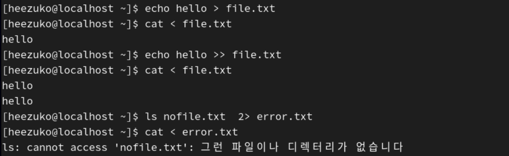
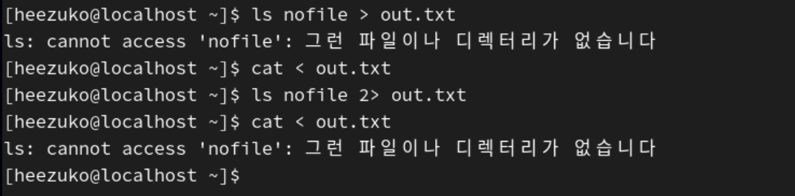
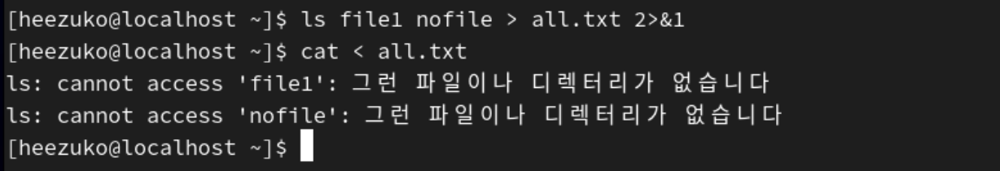
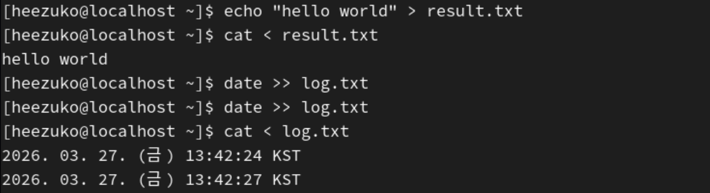
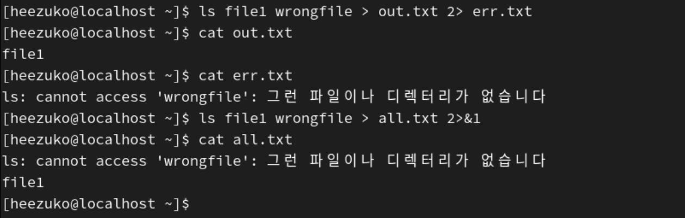
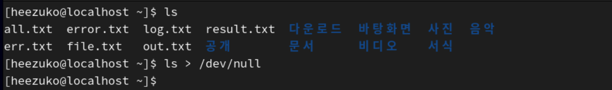

## Bash 기본 문법 및 입출력

### 1. Bash 셸

**사용자가 입력한 명령어를 해석하고 실행하는 프로그램(셸)**  
사용자가 터미널에서 입력한 명령을 받아서 운영체제에게 전달하고 결과를 출력해주는 역할을 함

<pre>
1. 사용자가 `ls` 입력
2. Bash가 명령어 해석
3. OS에게 실행 요청
4. 결과 출력
</pre>

### 2. 셸의 기본 구조

셸은 단순히 명령어를 실행하는 것이 아니라, `입력 → 처리 → 출력` 흐름으로 동작함

#### 2-1. 명령어 실행 방식

- 단순 실행
  <pre>ls</pre>.
  - 현재 디렉토리의 목록 출력

- 옵션 사용
    <pre>ls -l</pre>
  - 상세 정보 출력

- 여러 명령어 실행
    <pre>ls; pwd</pre>
  - 순차 실행
- 조건 실행
    <pre>mkdir test && cd test</pre>
  - 앞 명령어 성공 시 뒷 명령어도 실행
- 실패 시 실행
    <pre>mkdir test || echo "실패"</pre>
  - 앞 명령 실패 시 뒷 명령어 실행
- 백그라운드 실행
    <pre>sleep 10 & </pre>
  - 뒤에서 실행

=> Bash에서는 명령어를 순차 실행, 조건 실행, 백그라운드 실행 등 다양한 방식으로 실행할 수 있음

### 3. 변수 (variable)

**값을 저장하고 재사용하기 위한 공간**

- 선언
  <pre>
  name=heezuko
  name2="heezu ko"</pre>
  - 공백 금지! 공백이 있다면 `""` 사용
- 사용
    <pre>echo $name</pre>
  - 출력: `heezuko`

#### ✔️ 변수 특징

- 타입 없음 (문자열로 처리)
- `$`로 참조

### 4. 환경 변수

**시스템 전체에서 사용하는 변수**

#### 4-1. 확인 방법

<pre>
- printenv
- echo $HOME
</pre>

현재 `HOME`이라는 환경변수의 값으로 `/home/heezuko`가 들어가 있음

#### 4-2. 설정 방법

<pre>export MYVAR=hello</pre>

-> export 명령어를 통해 설정

#### ✔️ 대표 환경 변수

| 변수 | 의미               |
| ---- | ------------------ |
| HOME | 사용자 홈 디렉터리 |
| PATH | 실행 파일 경로     |
| USER | 사용자 이름        |

### 5. 표준 입력/출력/오류

**프로그램이 데이터를 입력받고 결과를 출력하는 기본 입출력 채널**

| 구분       | 의미 |
| ---------- | ---- |
| stdin (0)  | 입력 |
| stdout (1) | 출력 |
| stderr (2) | 오류 |

ex)

<pre>echo hello</pre>

-> `stdout` 출력

<pre>ls 없는파일</pre>

-> `stderr` 출력

#### ❓ 사용하는 이유

표준 입력, 출력, 오류는 프로그램이 데이터를 주고받는 기본 통로이지만, 단순 출력 기능을 넘어서 **정상 결과와 오류를 구분하기 위해 필요함**

ex) `echo hello`는 `stdout`으로 출력되고, `ls 없는파일`은 `stderr`로 출력됨 -> 둘의 결과를 다르게 처리할 수 있음

이러한 구분 덕분에 `ls > out.txt`처럼 정상 출력만 파일로 저장하거나, `ls 없는파일 2> error.txt`처럼 오류만 따로 기록하는 것이 가능해짐  
또한 `ls | grep txt`와 같이 `stdout`만 다음 명령어로 전달할 수 있어, **명령어를 연결한 자동화 작업에서도 중요한 역할**을 할 수 있음

👉 표준 입력/출력/오류의 구분은 **결과 관리, 오류 처리, 자동화 작업을 효율적으로 수행하기 위한 필수적인 기능**임

### 6. 리다이렉션 (Redirection)

**표준 입력(stdin), 표준 출력(stdout), 표준 오류(stderr)의 방향을 변경하는 기능**

기본적으로 리눅스에서 명령어를 실행하면 결과는 화면에 출력된다. 그런데 경우에 따라서는 그 결과를 화면이 아니라 파일에 저장하고 싶을 수도 있고, 반대로 사용자가 직접 입력하는 대신 파일 내용을 입력으로 넣고 싶을 수도 있다. 이때 사용하는 것이 리다이렉션이다.

-> 리다이렉션은 **프로그램의 입출력 경로를 바꿔서 데이터를 더 유연하게 다룰 수 있게 해주는 기능**임

리눅스에서는 입출력 채널이 번호로 구분됨
| 구분 | 의미 |
| --- | ---- |
| 0 | stdin (입력) |
| 1 | stdout(출력) |
| 2 | stderr (오류) |

#### 6-1. 입력 리다이렉션 (<)

<pre>cat < file.txt</pre>

`file.txt` 내용을 입력으로 사용해 화면에 출력

✨ `cat file.txt`와 결과는 비슷해 보일 수 있지만 `<`의 핵심은 **파일 내용**을 입력으로 넣는 것임!

ex) 어떤 프로그램이 원래 키보드 입력을 기다리는 상황에서, **직접 타이핑하지 않고 파일 내용을 대신 입력값으로 줄 수 있음**

#### 6-2. 출력 리다이렉션 (>)

1. 덮어쓰기 (>)
   <pre>echo hello > file.txt</pre>

   `file.txt`에 `“hello”` 저장 (기존 내용 삭제)

2. 이어쓰기 (>>)
   <pre>echo hello >> file.txt</pre>
   `file.txt` 기존 내용 뒤에 `"hello"` 추가

#### 6-3. 오류 리다이렉션 (2>)

<pre>ls 없는파일 2> error.txt</pre>

표준 오류 메시지를 화면에 출력하지 않고 `error.txt` 파일에 저장

#### 💥 표준 출력과 표준 오류는 다르다 ‼️

<pre>ls 없는파일 > out.txt</pre>

이 명령어는 `>`를 썼으니 뭔가 파일에 저장될 것 같지만, 실제로는 오류 메시지가 여전히 화면에 나온다.

왜냐하면 `>`는 기본적으로 표준 출력(stdout)만 리다이렉션하고, 오류(stderr)는 건드리지 않기 때문이다.

- 정상 결과는 `out.txt`로 감
- 오류 메시지는 화면에 그대로 남음  
  => 오류 메시지 파일에 저장 X, 오류까지 저장하려면 `2>`를 따로 써야 한다!

#### 6-4. 표준 출력과 표준 오류를 한 파일에 같이 저장하기 (2>&1)

<pre>ls file1 없는파일 > all.txt 2>&1</pre>

- `1` = stdout
- `2` = stderr
- `&1` = stdout이 향하는 대상

1. `> all.txt`  
   → 표준 출력(stdout)을 `all.txt`로 보냄
2. `2>&1`  
   → 표준 오류(stderr)를 표준 출력(stdout)이 가는 곳과 같은 곳으로 보냄

#### ✨ 더 편하게 쓰는 방법? (&>)

<pre>ls file1 없는파일 &> all.txt</pre>

stdout과 stderr를 모두 `all.txt`에 저장하는 더 간단한 표현

#### 6-5. /dev/null과 함께 쓰는 리다이렉션

리눅스에서는 `/dev/null`이라는 특별한 장치 파일이 있다.
여기로 보내진 데이터는 모두 버려진다.

1. 출력 버리기
   <pre>명령어 > /dev/null</pre>

   -> 정상 출력은 버리고, 화면에 보이지 않음

2. 오류 버리기
   <pre>명령어 2> /dev/null</pre>

   -> 오류 메시지는 버리고, 화면에 보이지 않음

3. 모두 버리기
   <pre>
   명령어 > /dev/null 2>&1
   명령어 &> /dev/null
   </pre>
   -> 정상 출력도 오류도 모두 버림

✨ 결과가 필요 없고 조용히 실행하고 싶을 때 사용함 ex) 백그라운드 작업, 자동화 스크립트

#### 6-6. 자주 쓰는 리다이렉션

| 기호         | 의미                      |
| ------------ | ------------------------- |
| >            | stdout 덮어쓰기           |
| >>           | stdout 이어쓰기           |
| <            | stdin 입력                |
| 2>           | stderr 저장               |
| 2>>          | stderr 이어쓰기           |
| > file 2>&1  | stdout + stderr 함께 저장 |
| &>           | stdout + stderr 함께 저장 |
| > /dev/null  | stdout 버리기             |
| 2> /dev/null | stderr 버리기             |

#### 실습

- `echo`로 담은 `"hello world"`가 `reslut.txt`에 덮어씌워짐
- `date`로 현재 시간을 `log.txt`에 계속 이어쓰기 함 (로그 누적 저장)

- 정상 결과는 `out.txt`, 오류는 `err.txt`에 따로 저장됨
  - `out.txt`: 정상 결과 저장
  - `err.txt`: 에러 저장
- 정상 결과와 오류 모두 `all.txt`에 저장됨

- 원래 `ls` 명령어 사용 시 화면에 dir과 file들이 나와야 정상임
- `/dev/null`을 이용해 출력을 버리면 결과가 화면에 출력되지 않음!

#### 정리

**리다이렉션**: 명령어의 입력과 출력을 원하는 방향으로 바꾸는 기능

- `>` 출력 덮어쓰기
- `>>` 출력 이어쓰기
- `<` 입력 리다이렉션에 사용
- `2>` 오류 리다이렉션에 사용
- `> file 2>&1` 정상 출력과 오류를 하나의 파일에 함께 저장

=> 이 기능은 **로그 관리, 자동화, 오류 분석**에 매우 중요하다!!

### 7. 파이프 (Pipe)

**한 명령어의 표준 출력(stdout)을 다른 명령어의 표준 입력(stdin)으로 전달하는 기능**  
-> 여러 명령어를 하나의 흐름으로 연결하여 데이터를 단계적으로 처리할 수 있게 해줌

#### 7-1. 기본 개념

<pre>명령어1 | 명령어2</pre>

명령어1의 결과를 명령어2의 입력으로 전달함

**흐름**: `명령어1 실행 → 결과(stdout) 생성 → 파이프(|) → 명령어2 입력(stdin)`

#### ❓ 파이프가 필요한 이유

파이프는 단일 명령어로 처리하기 어려운 작업을 여러 개의 명령어를 조합하여 해결할 수 있도록 해줌

ex)

- 파일 목록 출력 → 특정 문자열만 필터링
- 로그 파일 → 특정 패턴만 추출
- 데이터 → 정렬 → 중복 제거

👉 이런 **단계별 처리**를 가능하게 함

#### 7-2. 사용 예시

- 파일 필터링
   <pre>ls | grep txt</pre>

  ls 결과 중에서 txt가 포함된 것만 출력

- 프로세스 검색
  <pre>ps aux | grep ssh</pre>
  실행 중인 프로세스 중 ssh 관련 항목만 출력
- 줄 개수 세기
  <pre>ls | wc -l</pre>
  현재 디렉토리의 파일 개수(줄 수)를 출력

#### 7-3. 여러 개 연결 가능

파이프는 여러 개 이어서 사용할 수 있음

<pre>cat file.txt | sort | uniq</pre>

1. `cat file.txt` → 파일 내용 출력
2. `sort` → 정렬
3. `uniq` → 중복 제거

#### 7-4. 파이프의 특징

1. 파이프는 기본적으로 표준 출력(stdout)만 다음 명령어로 전달함
   <pre>ls | grep txt</pre>
   - ls의 stdout만 grep으로 전달됨
2. 오류(stderr)는 전달되지 않음
   <pre>ls 없는파일 | grep error</pre>
   - 오류 메시지는 grep으로 안 넘어감

#### ❓ 오류까지 파이프로 넘기려면

stderr까지 같이 처리하려면 stdout으로 합쳐야 한다.

<pre>ls 없는파일 2>&1 | grep error</pre>

- stderr를 stdout으로 합친 다음 파이프로 전달

### 7-5. 리다이렉션과 파이프의 관계

1. 파일 저장 + 파이프
   <pre>ls | grep txt > result.txt</pre>
   - 필터링 결과를 파일로 저장
2. 오류까지 포함
   <pre>ls 없는파일 2>&1 | tee log.txt</pre>
   - 오류 화면 출력 + 파일 저장 동시에

### 8. tee 명령어

**파이프 결과를 파일에도 저장하고 화면에도 출력하는 명령어**

ex)

<pre>ls | tee file.txt</pre>

- ls 결과가 화면에 출력되고 file.txt에도 저장됨

<pre>ls | tee -a file.txt</pre>

- 기존 내용에 이어씀 (append 모드)

<pre>cat access.log | grep 404</pre>

- 로그 필터링 (404 에러만 출력)

<pre>df -h | grep sda</pre>

- 디스크 사용량 확인

<pre>ps aux | grep nginx</pre>

- 프로세스 필터링

#### 정리

**파이프**: 한 명령어의 출력 결과를 다른 명령어의 입력으로 전달하여 여러 명령어를 연결하는 기능  
=> 데이터를 단계적으로 처리할 수 있으며, 복잡한 작업을 간단한 명령어 조합으로 해결할 수 있음
