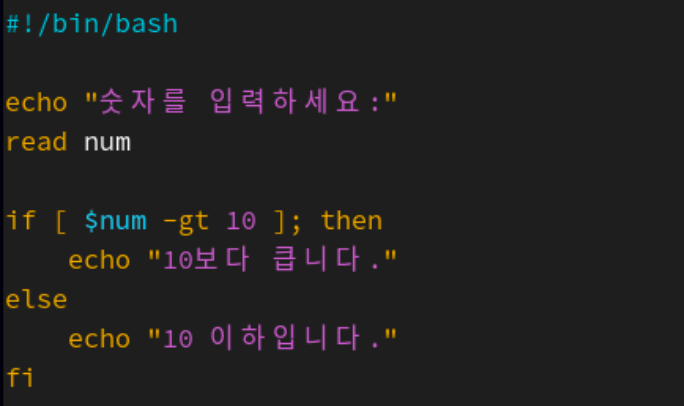
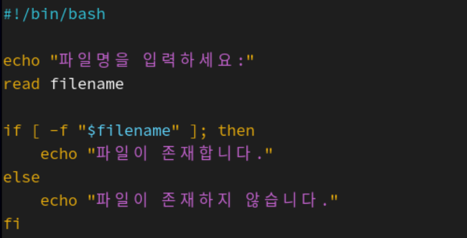
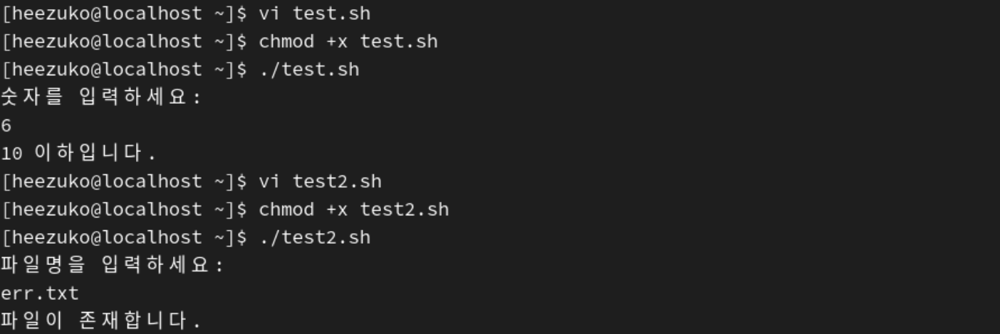
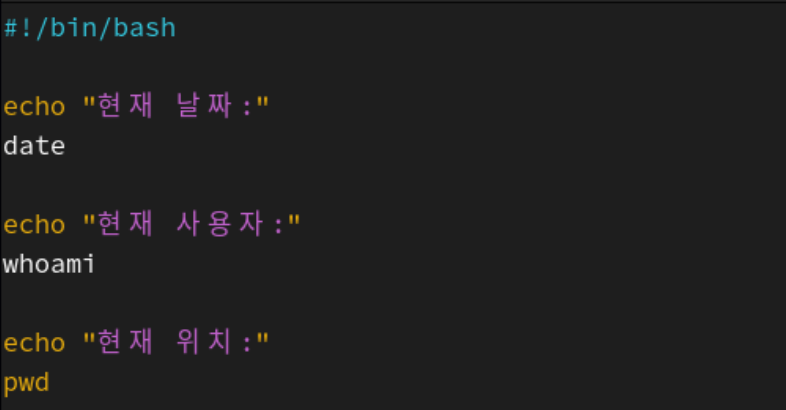
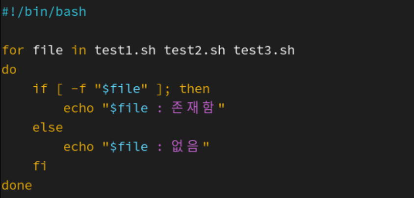
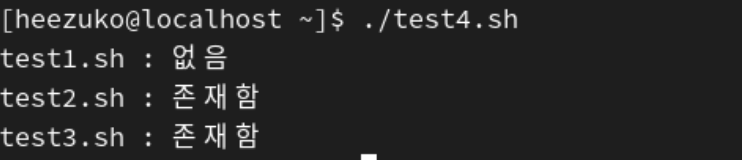
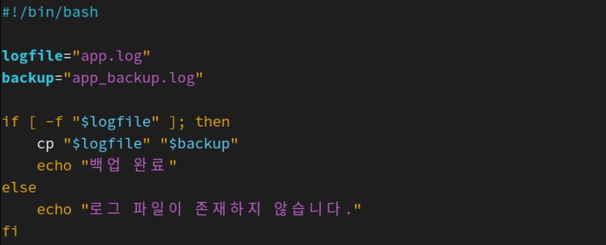
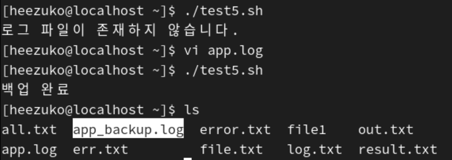

## 조건문·반복문 활용 스크립트와 관리 작업 자동화 실습

### 1. 셸 스크립트

**셸 명령어들을 모아 하나의 파일로 작성한 프로그램**  
터미널에서 하나씩 입력하던 명령어를 파일에 순서대로 작성해 두고, 필요할 때 한 번에 실행할 수 있도록 만든 것

<pre>date
whoami
pwd</pre>

이렇게 여러 명령어를 한 스크립트 파일로 저장하면 한 번 실행으로 여러 작업을 자동으로 수행할 수 있음

### 2. 셸 스크립트 기본 구조

<pre>
#!/bin/bash

echo "Hello World"
</pre>

`#!/bin/bash`  
: 운영체제에게 이 파일을 Bash 셸로 해석해서 실행하라고 알려주는 역할

### 3. 실행 방법

스크립트 파일 이름이 `test.sh`라면

1. bash로 실행
<pre>bash test.sh</pre>

2. 실행 권한 부여 후 직접 실행
<pre>
chmod +x test.sh
./test.sh
</pre>

### 4. 조건문

**특정 조건이 참인지 거짓인지에 따라 다른 동작을 수행하게 하는 문법**  
-> 상황에 따라 분기 처리

#### 4-1. if~elif

<pre>
if [ 조건1 ]; then
    실행1
elif [ 조건2 ]; then
    실행2
else
    실행3
fi
</pre>

ex)

<pre>
#!/bin/bash

score=85

if [ $score -ge 90 ]; then
    echo "A"
elif [ $score -ge 80 ]; then
    echo "B"
else
    echo "C"
fi
</pre>

#### 4-2. 조건식 비교 연산자

- **숫자 비교**
  연산자 | 의미 |
  ---- | ---- |
  -eq | 같다 |
  -ne | 같지 않다 |
  -gt | 크다 |
  -lt | 작다 |
  -ge | 크거나 같다 |
  -le | 작거나 같다 |
  - 예시
      <pre>
      if [ $a -eq $b ]; then
          echo "같다"
      fi</pre>

- **문자열 비교**
  연산자 | 의미 |
  ---- | ---- |
  = | 같다 |
  != | 다르다 |
  -z | 문자열 길이가 0 |
  -n | 문자열 길이가 0이 아님 |
  - 예시
    <pre>
    name="heezuko"
    
    if [ "$name" = "heezuko" ]; then
        echo "이름이 일치함"
    fi
    </pre>

- **파일 관련 비교**
  연산자 | 의미 |
  ----- | ----|
  -f | 파일이 존재함 |
  -d | 디렉터리가 존재함 |
  -e | 파일/디렉터리 존재 |
  -r | 읽기 가능 |
  -w | 쓰기 가능 |
  -x | 실행 가능 |
  - 예시
    <pre>
    if [ -f test.txt ]; then
        echo "파일이 존재함"
    fi
    </pre>

#### 4-3. 조건문 작성 시 주의점

1. 대괄호 안에는 공백 필수
<pre>
if [ $a -eq 1 ]; then   # O
if [$a -eq 1]; then     # X
</pre>

2. 문자열 비교 시 큰따옴표 사용 권장
<pre>
if [ "$name" = "heezuko" ]; then
    ...
</pre>

### 5. 반복문

**특정 명령을 여러 번 반복해서 실행**

#### 5-1. for 반복문

<pre>
for 변수 in 값목록
do
    실행할 명령
done
</pre>

ex)

<pre>
#!/bin/bash

for name in apple banana grape
do
    echo $name
done
</pre>

- 문자열 반복

<pre>
#!/bin/bash

for i in {1..5}
do
    echo $i
done
</pre>

- 1부터 5까지의 범위 반복

<pre>
for file in *.txt
do
    echo "$file"
done
</pre>

- 현재 디렉터리의 .txt 파일들을 하나씩 꺼내서 출력

#### 5-2. while 반복문

**조건이 참인 동안 계속 반복해서 실행**

<pre>
while [ 조건 ]
do
    실행할 명령
done
</pre>

ex)

<pre>
#!/bin/bash

num=1

while [ $num -le 5 ]
do
    echo $num
    num=$((num+1))
done
</pre>

- num이 5보다 작거나 같을 때 출력

### 6. 사용자 입력 받기

셸 스크립트에서 `read`를 사용하면 사용자 입력을 받을 수 있음

<pre>
#!/bin/bash

echo "이름을 입력하세요:"
read name

if [ "$name" = "heezuko" ]; then
    echo "관리자 계정입니다."
else
    echo "일반 사용자입니다."
fi
</pre>

|  |  |
| ------------------------ | ------------------------ |

### 7. 간단한 관리 자동화 실습

- 날짜와 사용자 정보 출력
   |  |
  | ------------------------ | ------------------------ |

- 여러 파일 존재 여부 검사
   |  |
  | ------------------------ | ------------------------ |

- 로그 파일 백업 자동화
   |  |
  | ------------------------ | ------------------------ |

=> 셸 스크립트에서는 조건문과 반복문을 조합하여 파일 검사, 로그 백업과 같은 반복적이고 단순한 관리 작업을 자동화할 수 있음!
