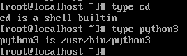

# Bash 셸의 기본 구조 이해

## 쉘의 동작

### Bash의 역할
- 사용자와 커널 사이의 중재 및 명령어 해석 진행  
    -> 인터프리터 역할 수행 (명령어 한 줄 씩 해석)

### Bash 실행 매커니즘 
``` 
+-----------------------------------------------------------+
|                      USER SPACE (사용자 영역)              |
|                                                           |
|  [ User Terminal ] <--- (Standard Input/Output) ---+      |
|          |                                         |      |
|          v                                         |      |
|  +-------+-------+       (1) Tokenizing/Parsing    |      |
|  |     BASH      | ----> (2) Variable Expansion    |      |
|  | (Interpreter) | ----> (3) Command Lookup        |      |
|  +-------+-------+                                 |      |
|          |                                         |      |
|          | (4) fork() : 부모 프로세스 복제            |      |
|          +--------------------[ Child Bash ]-------+      |
|          | (5) execve(): 명령어 바이너리로 교체        |      |
|          v                                                |
+----------|------------------------------------------------+
           | (6) SYSTEM CALL (커널에 권한 요청)
+----------|------------------------------------------------+
|          v           KERNEL SPACE (커널 영역)              |
|  +------------------------------------------------------+  |
|  |                  System Call Interface               |  |
|  +------------------------------------------------------+  |
|  |    Process Mgmt   |   Memory Mgmt   |   File System  |  |
|  +-------------------|-----------------|----------------+  |
|          |           |                 |        |          |
+----------|-----------|-----------------|--------|----------+
           v           v                 v        v
      [ CPU / RAM ]  [ RAM ]          [ I/O ]  [ DISK ]
```
- (1) **Tokenizing/Parsing** : 입력된 문자열을 토큰 단위로 분리
  - ls -al : 실행할 프로그램 + 옵션 이라는 구조 파악
  
- (2) **Variable Expansion** : $을 통해 변수로 활용한 경우 실제 값으로 치환 진행 

- (3) **Command Lookup** : 입력된 명령어가 Bash 내장 명령어인지 외부 파일인지 판단
            
  - 내장 명령어인 경우 : Bash 프로그램 코드 안에 포함되어 프로세스를 만들지 않고 직접 실행 (매우 빠름)
    - 자식 프로세스를 만들어 실행 시 부모에서 변화가 없음 -> bash의 직접 실행
  - 외부 명령어 : 디스크에서 실행 파일을 찾고 실행

- (4) **Fork** : bash 프로세스가 자식 프로세스 생성 
  - bash가 직접 실행 중 죽으면 터미널 자체가 죽어버림

- (5) **Execve** : 복제된 자식 프로세스가 실행 코드를 덮어쓰고 동작

- (6) **System Call** : 커널 영역에 시스템 콜을 하여 하드웨어에 접근
  - 사용자 영역의 프로그램은 하드웨어에 직접 접근할 권한이 없음 