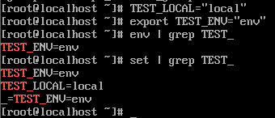
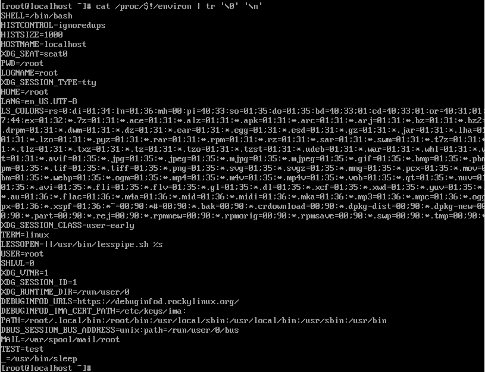
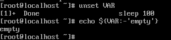
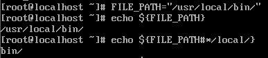
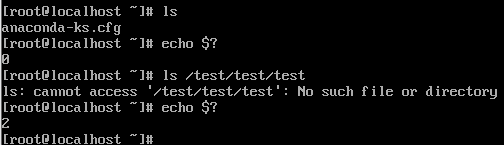
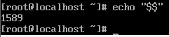
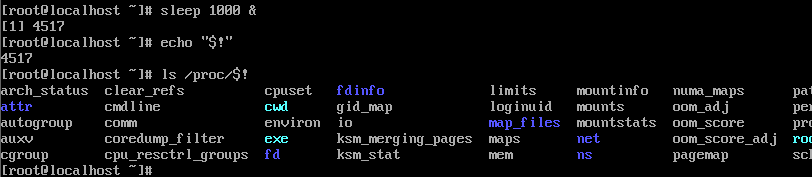

# 변수와 환경 변수 활용

## 지역변수 vs. 환경 변수
- 프로세스 간 전파 여부를 기준으로 차이 존재
  
| 구분 | 지역 변수 | 환경 변수 |
| - | - | - |
| 정의 | 현재 쉘 세션에서만 유효 | 현재 쉘 및 모든 자식 프로세스에 전달 |
| 선언 | `VAR=value` | `export VAR=value`|
| 범위 | 현재 Bash 프로세스 내부 | Fork 시 자식 프로세스의 메모리로 복제 |

### 변수 확인 명령어의 차이

- `env` / `export` : 환경 변수 (자식에게 전파될 변수) 목록만 출력
- `set` : 환경 변수와 지역 변수, 정의된 쉘 함수까지 모두 포함하여 출력
  - 쉘 함수 : 명령어들의 집합을 하나의 명령어로 사용 
  - 단순히 변수 출력이 아닌 현재 쉘 세션의 모든 설정 상태 출력이 목적

### 환경 변수 설정 시의 변수 저장
- `export` 시 Bash의 environment list라는 데이터 영역으로 이동
- 이후 execve() 시스템 콜이 호출될 때 새로운 프로세스의 스택/데이터 영역으로 복사
    ``` bash
    $ cat /proc/$!/environ
    ```
    

### 변수의 상속 과정
1. 부모 Bash  
  지역 변수가 Bash 자체의 메모리 테이블에 존재
  
1. Fork  
자식 Bash가 생성될 때 부모의 메모리를 복제하지만, `export` 되지 않은 지역 변수는 자식에게 보이지 않거나 초기화

1. Export  
`export`된 변수는 자식 프로세스가 `execve()`를 통해 실행될 때 환경 변수 배열을 통해 전달 

## 쉘 변수의 확장

### 치환 매커니즘
- `$VAR` : 간결한 사용, 혼동의 여지가 없을 때 주로 사용
-  `${VAR}` : 변수의 경계 명확화, 문자열 조작, 배열 접근 시 사용

### 매캐변수 확장 
- `${VAR: -default}` : 변수가 없으면 기본값 사용
    
- ${VAR#pattern} : 앞부분부터 패턴 일치 시 삭제
    

### 특수 변수
- `$?` : 최근 실행한 명령어의 종료 상태  
    
  - 0 : 성공
  - 0이 아닌 결과 : 실패  

- `$$` : 현재 쉘의 PID  
    

- `$!` : 최근에 실행한 백그라운드 프로세스의 PID  
    


## 환경 설정 파일
- 변수가 어디에 선얻되는지에 따라 생명주기 결정

### 로그인 쉘 
- `/etc/profile`, `~/.bash_profile`
- 로그인 시 한 번 로드
- 전역적 환경 설정
- 내부에 비로그인 쉘 파일을 불러오는 코드가 포함되어 계층적으로 연결

### 비로그인 쉘 
- `~/.bashrc`
- 새 터미널을 여러 때마다 로드
- 별칭이나 개별 환경 변수 설정 가능

### 즉시 적용
-  새 프로세스를 띄우지 않고 현재 쉘에서 해석 