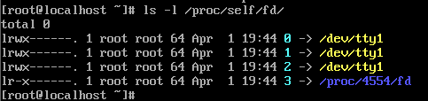
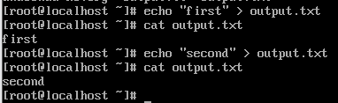
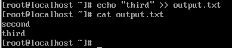
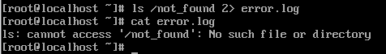
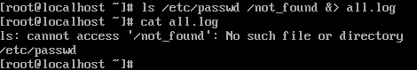
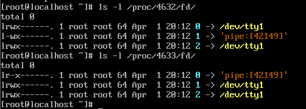

# 표준 입출력 및 리다이렉션/파이프

## 표준 스트림의 이해
- 프로세스 실행 시 커널은 기본적으로 3개의 파일 디스크립터(FD) 할당  
  - FD : 어떤 장치나 파일로 통하는 연결 통로의 번호 (프로세스마다 개별 생성)  
    -> 연결된 것이 디스크 파일, 키보드, 네트워크 소켓 등일 수 있음 

| FD 번호 | 이름 | 설명 | 기본 장치 |
| - | - | - | - |
| 0 | `stdin` (표준 입력) | 프로세스로 들어오는 데이터 | 키보드 |
| 1 | `stdout` (표준 출력) | 프로세스가 정상적으로 내보내는 데이터 | 터미널 화면 |
| 2 | `stderr` (표준 에러) | 프로세스가 에러 발생 시 내보내는 데이터 | 터미널 화면 |


``` bash
$ ls -l /proc/self/fd/
```

- `ls` 작업으로 디렉토리를 읽기 위한 3번 통로가 임시 생성됨

### 표준 스트림과 프로세스 간의 구조
``` 
[ 사용자 영역 (User Space) ]          [ 커널 영역 (Kernel Space) ]          [ 하드웨어 (Hardware) ]
  +--------------------------+        +--------------------------+        +--------------------------+
  |                          |        |                          |        |                          |
  |      PROCESS (ls, cat)   |        |    File Descriptor       |        |    Physical Devices      |
  |                          |        |         Table            |        |                          |
  |   +------------------+   |        |    +----------------+    |        |    +----------------+    |
  |   |  Code & Memory   |   |        |    | FD 0 (stdin)  |-----------> |    | Keyboard (tty) |    |
  |   +------------------+   |        |    +----------------+    |        |    +----------------+    |
  |            |             |        |    +----------------+    |        |    +----------------+    |
  |            +-------------|------> |    | FD 1 (stdout) |-----------> |    | Monitor (tty)  |    |
  |            |             |        |    +----------------+    |        |    +----------------+    |
  |            +-------------|------> |    | FD 2 (stderr) |-------+    |    +----------------+    |
  |                          |        |    +----------------+    |     +--> | Monitor (tty)  |    |
  +--------------------------+        +--------------------------+          +----------------+    |
                                                                            | (동일한 터미널 출력) |
                                                                            +--------------------+
```

### FD 0 : stdin (Standart Input)
- 버퍼링 : 커널의 입력 버퍼로 키보드로 입력 시 엔터를 치기 전까지 프로세스가 데이터를 읽지 않고 대기
- `< file` : 커널이 프로세스의 FD 0번이 가리키는 대상을 키보드 장치에서 디스크의 특정 파일로 교체 

### FD 1 : stdout (Standard Output)
- 라인 버퍼링 : 일반적으로 줄바꿈이 발생할 때 화면에 출력
  - 풀 버퍼링 : 파일로 리다이렉션을 하는 경우 효율을 위해 일정 크기가 쌓일 때까지 기다렸다가 한 번에 기록

### FD 2 : stderr (Standard Error)
- 표준 에러는 보통 버퍼링을 하지 않아 프로그램이 죽기 직전 마지막 에러 메시지를 사용자에게 즉시 전달하기 위하여 분리
- 파이프로 데이터를 넘길 때 에러 메시지는 파이프를 타지 않고 화면에 바로 출력

## 리다이렉션
- 기본장치 (화면/키보드)가 아닌 파일로 데이터의 흐름을 돌리는 메커니즘
  
### 출력 리다이렉션
- `>` : 파일 덮어 쓰기  
    

- `>>` : 파일 끝에 추가  
    

- `2>` : 에러 메시지만 파일로 저장  
    

- `&>` : 표준 출력과 에러를 한꺼번에 저장  
    

### 입력 리다이렉션
- `<` : 파일의 내용을 명령어의 입력으로 전달
- `<<` : 스크립트 내에서 여러 줄의 입력을 직접 전달

## 파이프 : 프로세스 간 통신 
- 앞 프로세스의 stdout(1)을 뒤 프로세스의 stdin(0)으로 연결

### 파이프 방식이 선택된 이유
- 스트리밍 : 파이프는 앞 작업이 다 끝나기를 대기하지 않음
- 메모리 효율성 : 커널 메모리에서만 데이터를 처리하여 자원 소모 감소

### 파이프의 동작

- `A | B` : 파이프 명령어 시 커널이 메모리에 64KB (기본값) 크기의 공유 버퍼 생성  
    - 프로세스 A의 FD 1(stdout)을 버퍼의 입구와 연결
    - 프로세스 B의 FD 0(stdin)을 버퍼의 출구와 연결