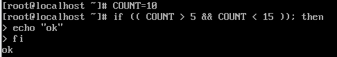
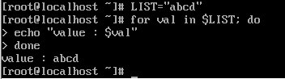
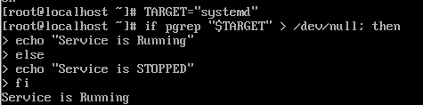

# 조건문과 반복문

## 조건문의 구조
``` bash
# 기본 구조
if [ 조건식 ]; then
    # 조건이 참(0)일 때 실행
elif [[ 다른조건 ]]; then
    # 앞의 조건이 거짓이고 현재 조건이 참일 때 실행
else
    # 모든 조건이 거짓일 때 실행
fi
```

## 조건문의 본질 : 명령어의 종료 상태
- Bash의 `if`는 명령어의 성공 여부를 확인

### Exit Status `0`
- 리눅스에서 명령어 성공은 `0`  
    -> `if`문은 실행한 명령어가 `0` 반환 시 `then` 으로 진입

## 조건식의 세가지 종류

| 구문 | 이름 | 설명 |
| - | - | - |
| `[ ]` | test 명령어 | `/usr/bin/[]` 라는 명령어 |
| `[[ ]]` | Keyword | Bash 전용 확장 구문 |
| `(( ))` | 산술 계산 | C 언어 스타일의 수치 비교 사용|

### `[ ]`
![[ ]](image/logic_02.png)
- 명령어이기 때문에 모든 인자 사이에 공백 필수
- 변수가 비어있을 경우(`if [ $VAR == "a" ]`인데 `$VAR`가 없을 때), `if [ == "a" ]`로 해석되어 문법 에러가 발생  
    -> 이를 방지하기 위해 과거에는 `[ "$VAR" == "a" ]`처럼 따옴표를 강제

### `[[ ]]`
![[[ ]]](image/logic_03.png)
- 패턴매칭 : `[[ $FILE == *.sh ]]`와 같이 와일드카드나 정규표현식(`=~`) 사용이 가능
- 안전성 : 변수가 비어있어도 에러를 내지 않고 빈 문자열로 처리
- 논리 연산 : 내부에서 `&&`, `||` 연산자 직접 사용 가능

### `(( ))`

- 숫자의 수치 비교 및 연산에 특화
- 변수 앞에 $ 기호를 붙이지 않아도 자동으로 변수 값을 가져옴 (`(( count > 10 ))`)


## 반복문의 구조

### for 문의 구조
``` bash
# 기본 구조
for 변수 in 항목1 항목2 항목3 ...
do
    # 실행할 명령어
done
```

### while 문의 구조
``` bash
# 기본 구조
while [ 조건식 ]
do
    # 실행할 명령어
done
```

### for vs. while
| 구분 | for 문 | while 문|
| - | - | - |
| 핵심 목적 | 정해진 데이터 목록(문자열) 처리 | 특정 상태(조건)가 유지되는 동안 처리 |
| 주요 입력 | 파일 목록, 단어 리스트, $(명령어) 결과 | 사용자 입력, 파일의 각 줄, 숫자 카운트 |
| 동작 특징 | IFS에 의해 쪼개진 단어 단위 순회 | 종료 상태($?)rk 0인 동안 무한 반복 가능 |

### 반복문의 반복 기준
- Bash의 반복문은 배열이 아닌 문자열 덩어리 관리   



## IFS (구분자)
- 공백을 기준으로 나눌지 줄바꿈을 기준으로 나눌지 결정하는 기준값

### IFS (구분자)의 한계
- 파일 명이 `My Document.txt`일 때, `for f in $(ls)`를 하면 Bash는 이를 `My`와 `Document.txt` 두 개의 파일로 오해  

### IFS 한계 극복
- 와일드카드(Globbing) : `for f in *.txt`는 Bash가 파일명을 통째로 넘기므로 안전
- IFS 임시 변경 : `IFS=$'\n'`으로 설정하면 줄바꿈 전까지는 공백이 있어도 한 덩어리로 취급

## 조건문과 반복문을 활용한 스크립트

### 서비스 상태 모니터링
``` bash
if pgrep "$TARGET" > /dev/null; then
    echo "Service is Running."
else
    echo "Service is STOPPED"
fi
```
