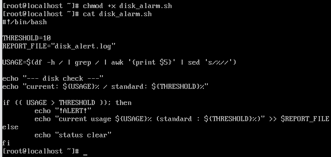
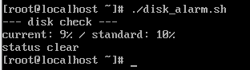
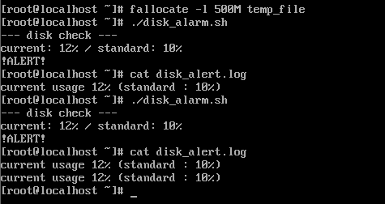

# 간단한 관리 작업 자동화 실습
- 시스템 자원 임계치 알람 관리 작업

## 대상 및 로직
- 대상 : 서버의 디스크 사용량 (`df`) 또는 CPU 부하 수치
- 로직 
  - 명령어 결과에서 숫자만 추출  
    -> 추출한 숫자가 정한 기준값과 대소 비교  
    -> 기준 초과 시 알림

## 관리 스크립트
``` bash
#!/bin/bash

THRESHOLD=80
REPORT_FILE="disk_alert.log"

USAGE=$(df -h / | grep / | awk '{print $5}' | sed 's/%//')

echo "--- disk check ---"
echo "current usage: ${USAGE}% / standard ${THRESHOLD}"

if (( USAGE > THRESHOLD )); then
    echo "!ALERT!"
    echo "current usage ${USAGE}% (standard : ${THRESHOLD}%)" >> $REPORT_FILE
    
else
    echo "status clear"
fi
```

### 적용
``` bash
# 권한 부여
$ chmod +x disk_alarm.sh

# 확인
$ cat disk_alarm.sh
```


## 실행
``` bash
$ ./disk_alarm.sh
```

### 성공 동작


### 실패 동작
``` bash
# 빈 파일 임시 생성 
$ fallocate -l 500M temp_file
```
