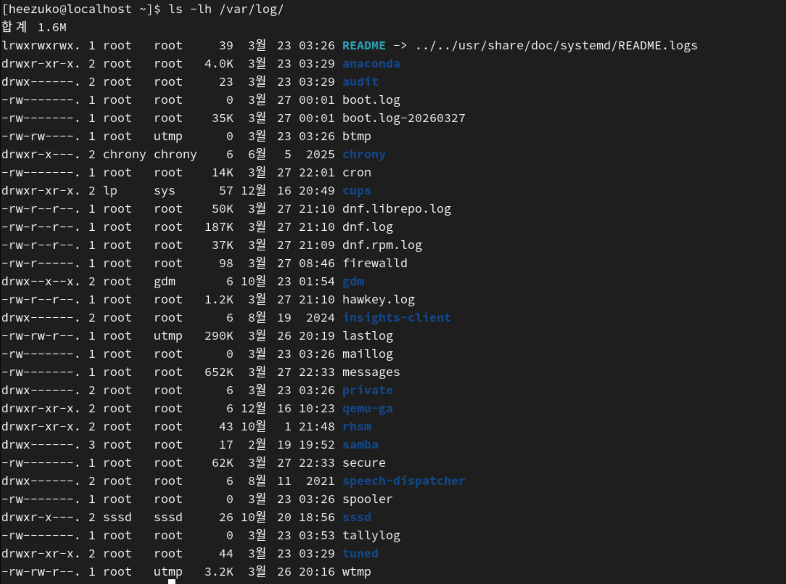
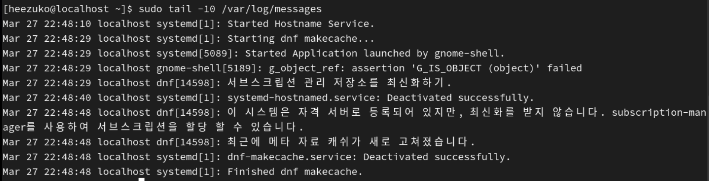
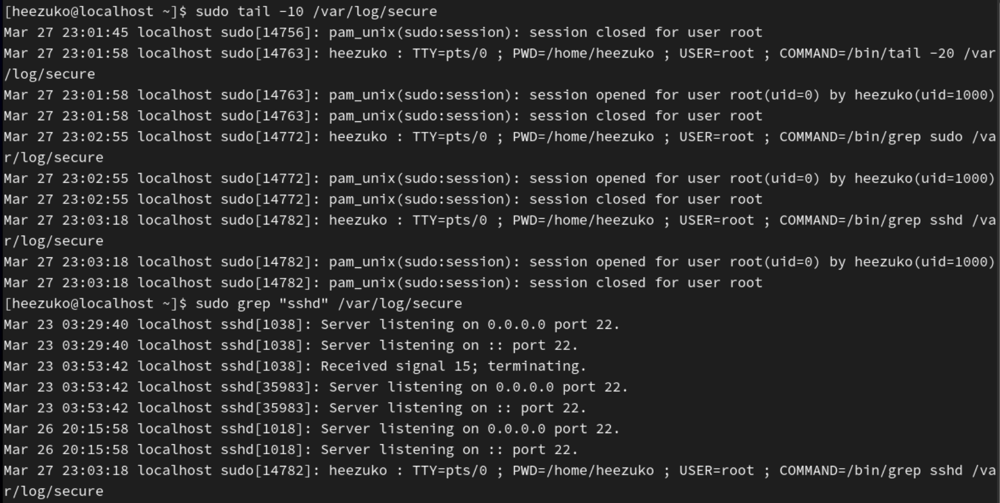
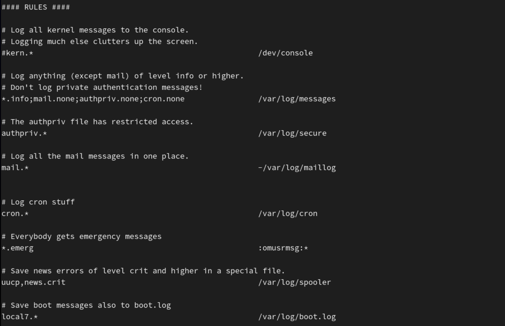
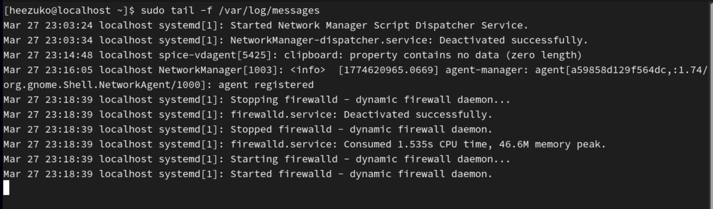
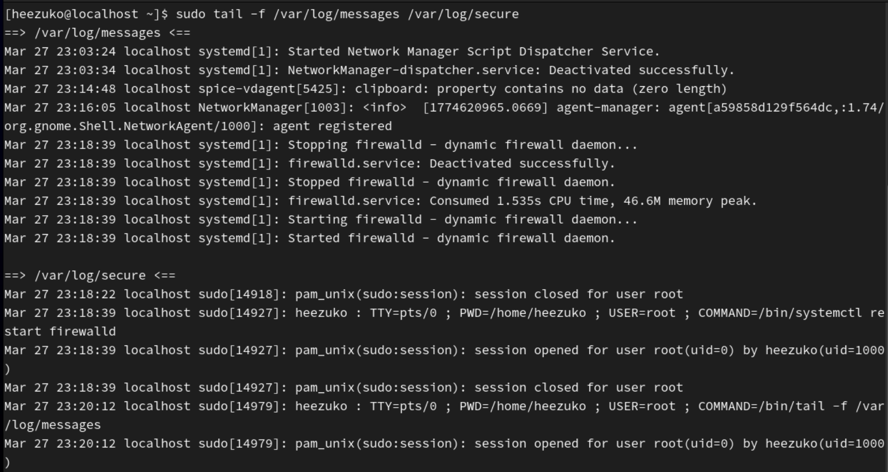
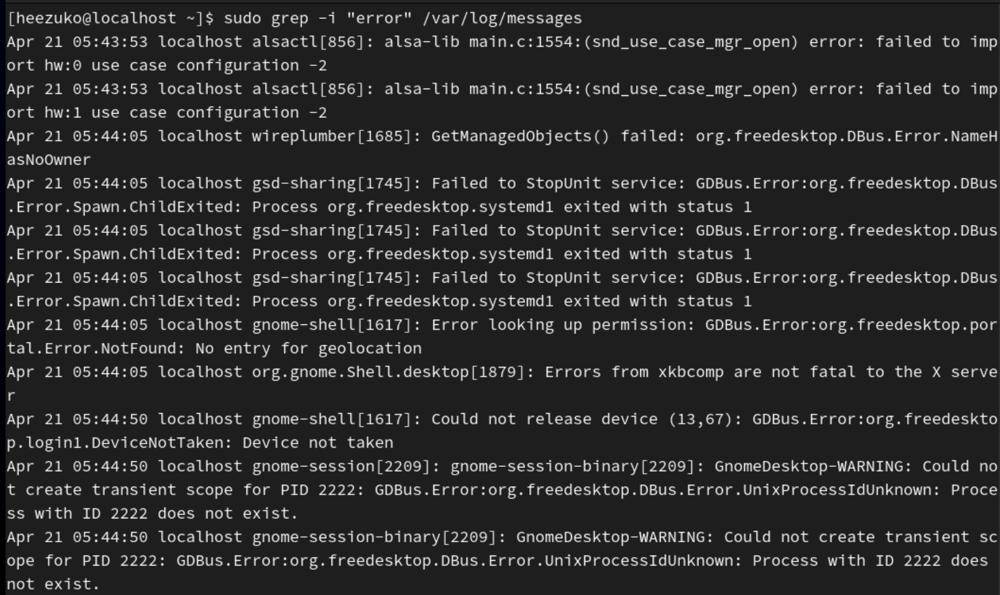
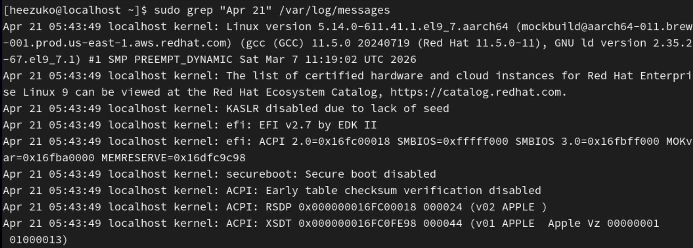
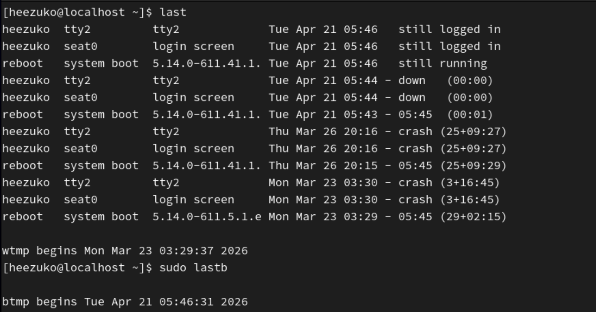
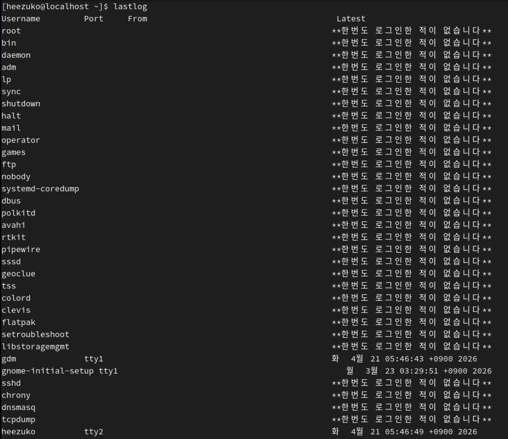

## 로그의 역할과 주요 로그 파일 구조 이해

### 1. 로그(Log)

로그는 시스템, 애플리케이션, 서비스가 동작하면서 발생하는 **이벤트 기록**  
운영자는 로그를 통해 다음과 같은 작업을 수행한다:

| 용도              | 설명                            |
| ----------------- | ------------------------------- |
| **장애 분석**     | 오류 발생 원인 파악 및 복구     |
| **보안 감사**     | 비인가 접근, 이상 행동 탐지     |
| **성능 모니터링** | 시스템 자원 사용 추이 파악      |
| **규정 준수**     | 감사(Audit) 로그 보관 요건 충족 |
| **운영 자동화**   | 로그 기반 알림 및 자동 대응     |

---

### 2. RHEL의 로그 시스템 구조

RHEL 7 이후부터는 **두 가지 로그 시스템이 병렬로 동작**한다.

<pre>
┌─────────────────────────────────────────────┐
│              systemd (PID 1)                │
│                                             │
│  ┌──────────────┐    ┌────────────────────┐ │
│  │  journald    │    │       rsyslog      │ │
│  │  (바이너리)    │───▶│   (텍스트 파일 저장)   │ │
│  │  /run/log/   │    │      /var/log/     │ │
│  │  journal/    │    │                    │ │
│  └──────────────┘    └────────────────────┘ │
└─────────────────────────────────────────────┘
</pre>

#### 2-1 systemd-journald

- systemd가 관리하는 **바이너리 형식의 로그 수집 데몬**
- 커널 메시지, 서비스 stdout/stderr, syslog 메시지를 모두 수집
- `journalctl` 명령어로 조회
- 기본적으로 재부팅 시 휘발 (영구 저장 설정 가능)

#### 2-2 rsyslog

- 전통적인 **텍스트 기반 로그 관리 데몬**
- `/etc/rsyslog.conf` 및 `/etc/rsyslog.d/*.conf` 로 설정
- `/var/log/` 디렉토리에 텍스트 파일로 저장
- 원격 로그 서버로 전송 기능 지원

---

### 3. 주요 로그 파일 목록 및 역할

```bash
ls -lh /var/log/
```


`/var/log/` 디렉토리 내 파일 목록 확인

---

#### 3-1. 핵심 로그 파일 상세

| 파일 경로                  | 관련 데몬 | 주요 내용                                    |
| -------------------------- | --------- | -------------------------------------------- |
| `/var/log/messages`        | rsyslog   | 일반 시스템 메시지 (기본 종합 로그)          |
| `/var/log/secure`          | rsyslog   | 인증, SSH, sudo 관련 보안 로그               |
| `/var/log/cron`            | rsyslog   | crond가 실행한 작업 기록                     |
| `/var/log/maillog`         | rsyslog   | 메일 서비스(postfix 등) 관련 로그            |
| `/var/log/boot.log`        | systemd   | 부팅 시 서비스 시작/종료 기록                |
| `/var/log/dmesg`           | 커널      | 커널 링 버퍼 메시지 (하드웨어 감지 등)       |
| `/var/log/audit/audit.log` | auditd    | SELinux, 파일 접근, 시스템 호출 감사         |
| `/var/log/httpd/`          | httpd     | Apache 웹 서버 접근/오류 로그                |
| `/var/log/yum.log`         | yum/dnf   | 패키지 설치/업데이트 이력                    |
| `/var/log/wtmp`            | 바이너리  | 로그인/로그아웃 기록 (`last` 명령으로 조회)  |
| `/var/log/btmp`            | 바이너리  | 로그인 실패 기록 (`lastb` 명령으로 조회)     |
| `/var/log/lastlog`         | 바이너리  | 마지막 로그인 시각 (`lastlog` 명령으로 조회) |

---

#### 3-2. `/var/log/messages` 상세

```bash
# 마지막 10줄 출력
tail -10 /var/log/messages
```

**로그 형식:**

<pre>
Apr 15 10:23:45 hostname kernel: [  0.000000] Initializing cgroup subsys cpuset
│                │        │         └─────────────────────── 메시지 본문
│                │        └───────────────────────────────── 프로세스명
│                └────────────────────────────────────────── 호스트명
└─────────────────────────────────────────────────────────── 타임스탬프
</pre>



1️⃣ `Mar 27 22:48:10 localhost systemd[1]: Started Hostname Service.`

- systemd가 호스트 이름(hostname)서비스를 시작함

2️⃣ `Mar 27 22:48:29 localhost systemd[1]: Starting dnf makecache...`

- dnf makecache = 패키지 목록 캐시 갱신
- systemd가 업데이트 확인을 빠르게 하기 위해 패키지 목록 최신화 시작함

---

#### 3-3. `/var/log/secure` 상세

```bash
# 마지막 10줄 출력
tail -10 /var/log/secure
# SSH 접속만 보기
grep "sshd" /var/log/secure
```



- heezuko 사용자가 root 권한으로(`sudo`로) 명령어 조회
- ssh 서버 22번 포트에서 listening 중

---

### 4. 로그 레벨(Log Level) 이해

로그는 심각도(Severity)에 따라 레벨이 구분된다.  
숫자가 낮을수록 심각한 수준이다.

| 번호 | 레벨          | 키워드    | 설명                             |
| ---- | ------------- | --------- | -------------------------------- |
| 0    | Emergency     | `emerg`   | 시스템이 사용 불가능한 상태      |
| 1    | Alert         | `alert`   | 즉각적인 조치가 필요한 상태      |
| 2    | Critical      | `crit`    | 심각한 오류 상태                 |
| 3    | Error         | `err`     | 오류 발생                        |
| 4    | Warning       | `warning` | 경고 (오류는 아니지만 주의 필요) |
| 5    | Notice        | `notice`  | 정상이지만 주목할 만한 이벤트    |
| 6    | Informational | `info`    | 일반 정보성 메시지               |
| 7    | Debug         | `debug`   | 디버깅 상세 정보                 |

💡 일반적으로 **warning(4) 이상**의 로그를 집중 모니터링한다.  
debug 레벨은 너무 많은 로그를 생성하므로 운영 환경에서는 비활성화하는 것이 권장된다.

### 5. rsyslog 설정 파일 구조

```bash
cat /etc/rsyslog.conf
```

#### 5-1. 설정 문법: `facility.severity  destination`

<pre>
// 형식
FACILITY.SEVERITY   ACTION

// 예시
kern.*              /dev/console          // 커널 로그 → 콘솔 출력
*.info;mail.none;authpriv.none;cron.none  /var/log/messages
authpriv.*          /var/log/secure       // 인증 로그 → secure 파일
mail.*              -/var/log/maillog     // 메일 로그 → maillog (비동기 쓰기)
cron.*              /var/log/cron         // cron 로그 → cron 파일
*.emerg             :omusrmsg:*           // 긴급 → 모든 사용자에게 메시지
</pre>

#### 5-2. Facility(시설) 종류

**Facility**: 로그 메시지를 발생시킨 출처  
-> 이 로그가 시스템의 어느 영역에서 발생했는지 구분하는 라벨

| Facility            | 설명                 |
| ------------------- | -------------------- |
| `kern`              | 커널 메시지          |
| `user`              | 일반 사용자 프로세스 |
| `mail`              | 메일 시스템          |
| `daemon`            | 시스템 데몬          |
| `auth` / `authpriv` | 보안/인증 메시지     |
| `syslog`            | syslogd 내부 메시지  |
| `cron`              | 스케줄 데몬          |
| `local0~local7`     | 로컬 사용 예약       |
| `*`                 | 모든 facility        |


`/etc/rsyslog.conf` 주요 설정 내용

### 6. 실습: 주요 로그 파일 확인

#### 6-1. 로그 파일 실시간 모니터링

```bash
# 실시간으로 로그 추적
tail -f /var/log/messages

# 여러 파일 동시 추적
tail -f /var/log/messages /var/log/secure
```



`tail -f`로 실시간 로그 확인 가능

#### 6-2. grep으로 키워드 필터링

```bash
# 오류 로그만 추출
grep -i "error" /var/log/messages

# 실패한 로그인 시도 확인
grep "Failed password" /var/log/secure | awk '{print $11}' | sort | uniq -c | sort -rn

# 특정 날짜 로그 추출
grep "Apr 21" /var/log/messages
```




- grep을 이용한 로그 필터링

#### 6-3. 바이너리 로그 파일 조회

```bash
# 로그인 기록 확인
last

# 로그인 실패 기록 확인 (root 권한 필요)
lastb

# 사용자별 마지막 로그인 시각
lastlog
```



