## journalctl을 활용한 시스템 로그 조회

### 1. journalctl

**systemd-journald**가 수집한 로그를 조회하는 명령어

- **systemd-journald**: 시스템에서 발생하는 모든 로그를 수집·저장하는 systemd의 로그 수집 데몬

```
프로그램 → journald → journal 로그 DB → journalctl로 조회
```

#### 1-1. journald의 특징

| 항목           | 내용                                             |
| -------------- | ------------------------------------------------ |
| 저장 형식      | 바이너리 (텍스트 편집기로 직접 열 수 없음)       |
| 수집 대상      | 커널 메시지, 서비스 stdout/stderr, syslog 메시지 |
| 기본 저장 위치 | `/run/log/journal/` (휘발성, 재부팅 시 삭제)     |
| 영구 저장 위치 | `/var/log/journal/` (설정 시)                    |
| 조회 명령어    | `journalctl`                                     |
| 설정 파일      | `/etc/systemd/journald.conf`                     |

### 2. journald 영구 저장 설정

기본 상태에서 journald 로그는 재부팅 시 삭제된다.  
영구 저장을 원하면 아래 설정이 필요하다.

```bash
# 영구 저장 디렉토리 생성
sudo mkdir -p /var/log/journal

# 저장 설정 변경
sudo vi /etc/systemd/journald.conf
```

```ini
[Journal]
Storage=persistent    # auto(기본), volatile, persistent, none
Compress=yes          # 로그 압축 활성화
SystemMaxUse=500M     # 저널 최대 용량 제한
```

```bash
# 설정 적용을 위해 journald 재시작
sudo systemctl restart systemd-journald

# 현재 저장 위치 확인
ls -lh /var/log/journal/
```

| 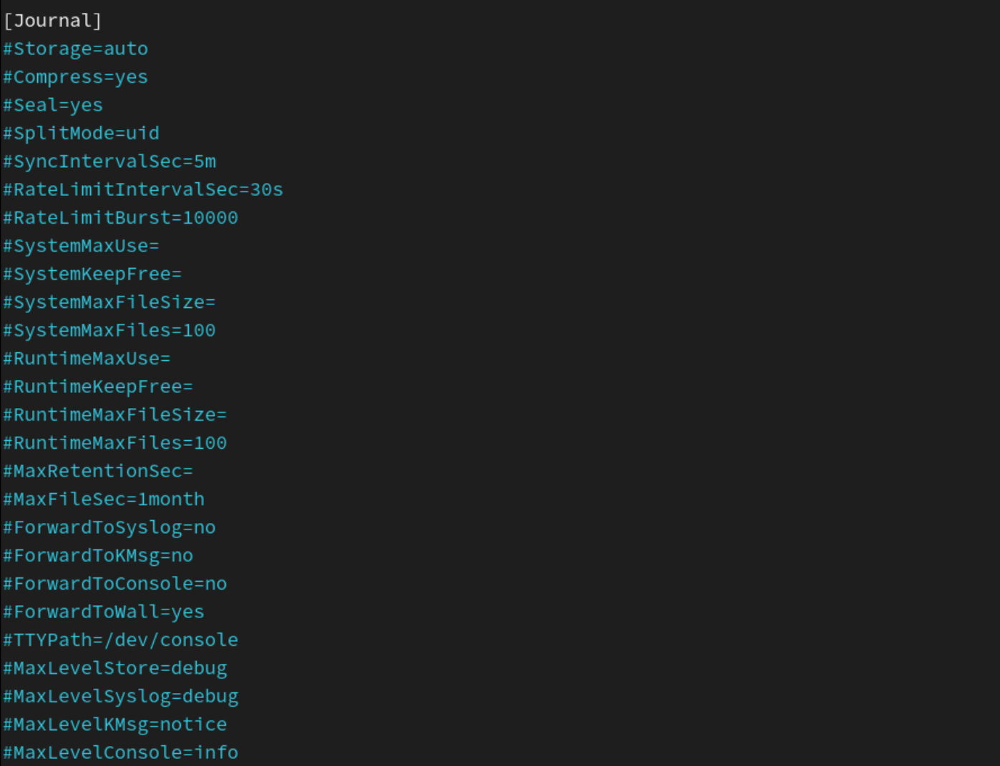 | ─▶  | 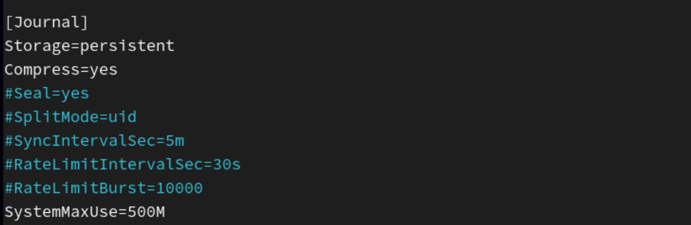 |
| ------------------------- | --- | ------------------------- |

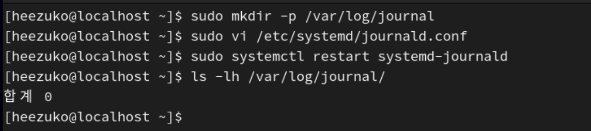
`/var/log/journal/` 디렉터리 생성 및 저장 확인

### 3. 기본 조회 명령어

#### 3-1. 전체 로그 조회

```bash
# 전체 저널 로그 조회 (가장 오래된 것부터)
journalctl

# 최신 로그부터 역순 조회
journalctl -r

# 마지막 10줄 조회
journalctl -n 10

# 실시간 로그 스트리밍 (tail -f와 동일)
journalctl -f
```

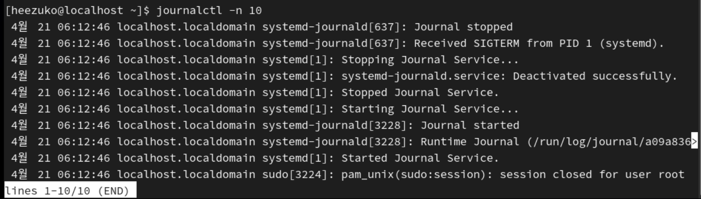

#### 3-2. 부팅 횟수 기반 조회

```bash
# 현재 부팅 이후 로그만 조회 (가장 자주 사용)
journalctl -b

# 이전 부팅 로그 조회 (-1: 바로 이전, -2: 2번 이전)
journalctl -b -1
journalctl -b -2

# 전체 부팅 목록 확인
journalctl --list-boots
```

**`--list-boots` 출력 예시:**

```
-3 a1b2c3d4... Tue 2025-04-13 08:00:00 KST—Tue 2025-04-13 18:00:00 KST
-2 e5f6g7h8... Wed 2025-04-14 08:00:00 KST—Wed 2025-04-14 17:30:00 KST
-1 i9j0k1l2... Thu 2025-04-15 08:00:00 KST—Thu 2025-04-15 20:00:00 KST
 0 m3n4o5p6... Fri 2025-04-16 08:00:00 KST—현재
```

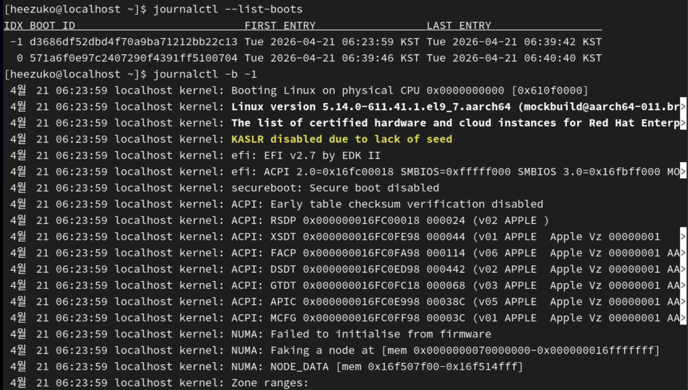
부팅 이력 목록 확인

### 4. 시간 기반 필터링

#### 4-1. `--since` / `--until` 옵션

```bash
# 특정 시각 이후 로그
journalctl --since "2025-04-15 10:00:00"

# 특정 시각 이전 로그
journalctl --until "2025-04-15 12:00:00"

# 시간 범위 지정
journalctl --since "2025-04-15 10:00:00" --until "2025-04-15 12:00:00"

# 상대적 시간 표현
journalctl --since "1 hour ago"
journalctl --since "yesterday"
journalctl --since "today"
journalctl --since "-30min"
```

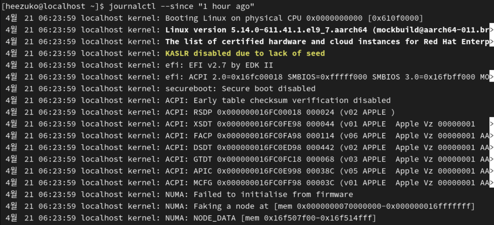
`--since` 옵션 활용 예시

#### 4-2. 시간 형식 정리

| 표현      | 예시                               |
| --------- | ---------------------------------- |
| 절대 시각 | `"2025-04-15 10:30:00"`            |
| 날짜만    | `"2025-04-15"`                     |
| 상대 시간 | `"1 hour ago"`, `"30 minutes ago"` |
| 키워드    | `"today"`, `"yesterday"`, `"now"`  |

### 5. 서비스(유닛) 기반 필터링

#### 5-1. 특정 서비스 로그 조회

```bash
# 특정 서비스 로그 조회
journalctl -u sshd
journalctl -u httpd
journalctl -u crond
journalctl -u firewalld

# 현재 부팅 이후 특정 서비스 로그
journalctl -u sshd -b

# 실시간 서비스 로그 모니터링
journalctl -u sshd -f

# 여러 서비스 동시 조회
journalctl -u sshd -u httpd
```

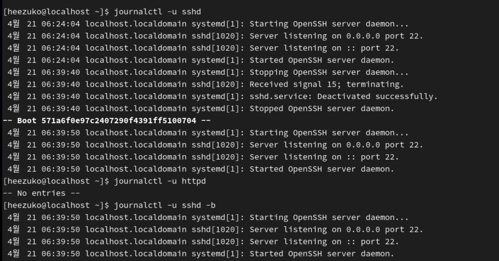

---

#### 5-2. PID / UID / GID 기반 필터링

```bash
# 특정 PID의 로그
journalctl _PID=1234

# 특정 사용자 ID의 로그
journalctl _UID=1000

# 특정 실행 파일 기반 필터
journalctl _EXE=/usr/sbin/sshd
```

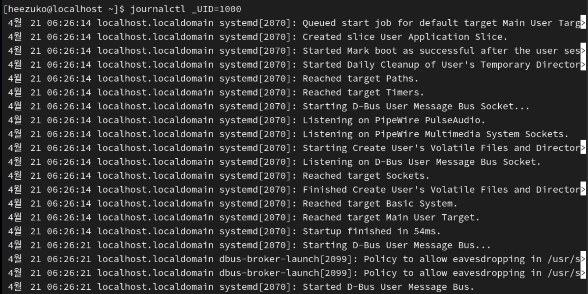
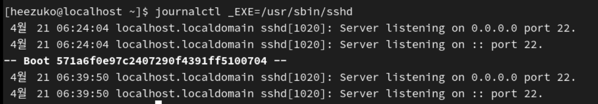

### 6. 우선순위(Priority) 기반 필터링

#### 6-1. `-p` 옵션으로 레벨 필터링

```bash
# 특정 레벨만 조회
journalctl -p err         # err(3) 레벨만
journalctl -p warning     # warning(4) 레벨만

# 특정 레벨 이상 조회 (0~N)
journalctl -p 0..3        # emerg ~ err (심각한 오류)
journalctl -p err..warning  # 범위 지정

# 실무에서 자주 사용: 현재 부팅의 에러 이상 로그
journalctl -b -p err
```

#### 6-2. 우선순위 레벨 참조

| 옵션      | 번호 | 의미             |
| --------- | ---- | ---------------- |
| `emerg`   | 0    | 시스템 사용 불가 |
| `alert`   | 1    | 즉각 조치 필요   |
| `crit`    | 2    | 심각한 오류      |
| `err`     | 3    | 오류             |
| `warning` | 4    | 경고             |
| `notice`  | 5    | 주목할 이벤트    |
| `info`    | 6    | 정보             |
| `debug`   | 7    | 디버그 정보      |

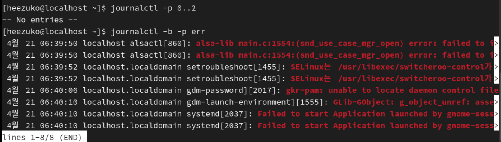

### 7. 커널 메시지 조회

```bash
# journalctl로 커널 메시지만 조회
journalctl -k
journalctl --dmesg

# dmesg 명령어로도 조회 가능
dmesg
dmesg | grep -i error
dmesg | grep -i "fail"
dmesg --level=err,crit    # 특정 레벨만
dmesg -T                  # 타임스탬프를 사람이 읽기 쉬운 형식으로
```

| 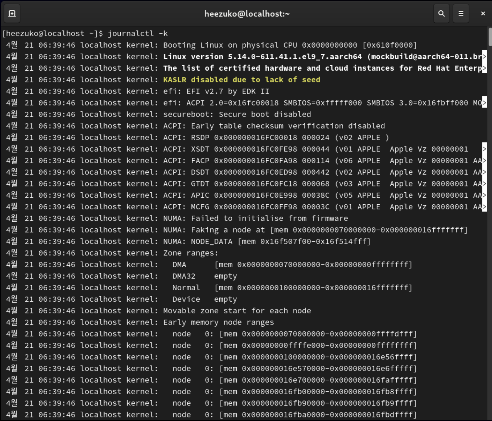 | 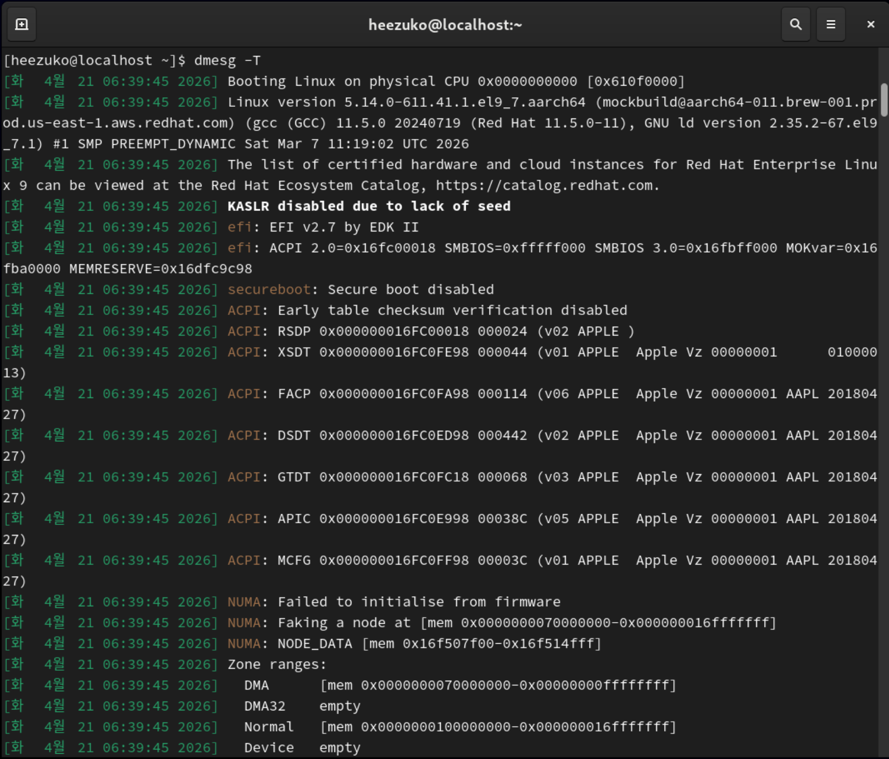 |
| ------------------------- | ------------------------- |

`journalctl -k` 및 `dmesg -T` 실행 결과

### 8. 출력 형식 제어

#### 8-1. `-o` 옵션으로 출력 포맷 변경

```bash
# 간략한 형식 (기본값)
journalctl -o short

# 상세 형식 (모든 메타데이터 포함)
journalctl -o verbose

# JSON 형식 출력 (자동화/파싱에 유용)
journalctl -o json
journalctl -o json-pretty   # 들여쓰기 포함한 JSON

# 카탈로그 메시지 포함 (오류 설명 추가)
journalctl -o cat

# Unix 타임스탬프 형식
journalctl -o short-unix
```

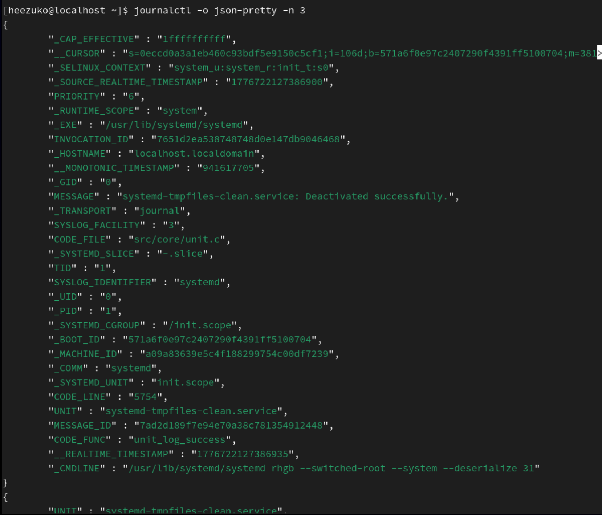
`journalctl -o json-pretty -n 3` 실행 결과

#### 8-2. grep과 조합

```bash
# journalctl 출력에 grep 적용
journalctl -b | grep "Failed"
journalctl -u sshd | grep "Invalid user"
journalctl --since today | grep -i error | wc -l
```

### 9. 로그 용량 관리

```bash
# 현재 저널 디스크 사용량 확인
journalctl --disk-usage

# 오래된 로그 정리 (보관 기간 기준)
sudo journalctl --vacuum-time=7d    # 7일 이전 로그 삭제
sudo journalctl --vacuum-time=30d   # 30일 이전 로그 삭제

# 용량 기준으로 정리
sudo journalctl --vacuum-size=200M  # 200MB 초과분 삭제

# 로그 파일 개수 기준으로 정리
sudo journalctl --vacuum-files=5    # 최근 5개 파일만 유지
```

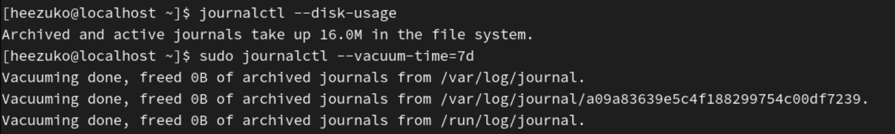

- `journalctl --disk-usage`: 16.0M 사용
- `--vacuum-time=7d` 실행 결과: 아까 재부팅했더니 아직 그만큼의 로그가 안 쌓여서 삭제 X

#### ✚ 자주 쓰는 journalctl 명령어 치트시트

```bash
journalctl -b                          # 현재 부팅 전체 로그
journalctl -b -p err                   # 현재 부팅 에러 이상 로그
journalctl -u <service> -f             # 서비스 실시간 로그
journalctl --since "1 hour ago"        # 최근 1시간 로그
journalctl -u <service> -b -p warning  # 서비스 + 부팅 + 우선순위 복합 필터
journalctl --disk-usage                # 저널 용량 확인
journalctl --vacuum-time=30d           # 30일 이상 로그 정리
```
