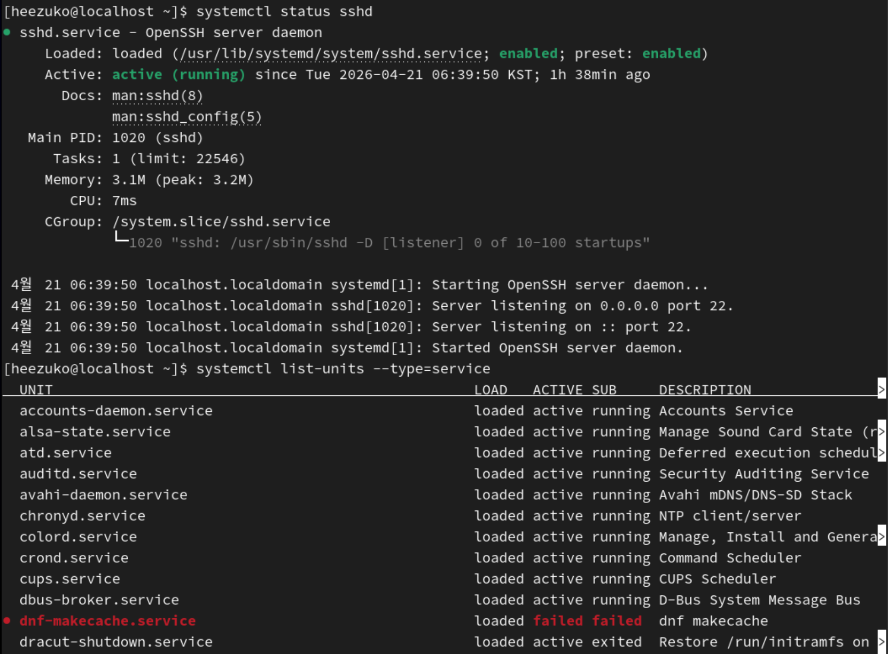
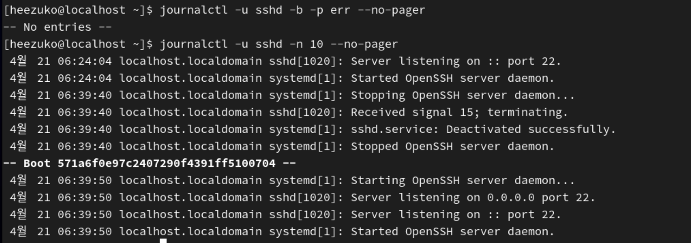
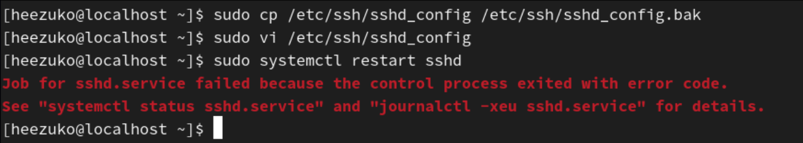
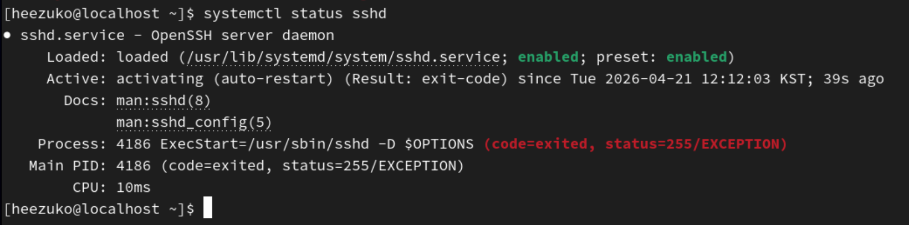
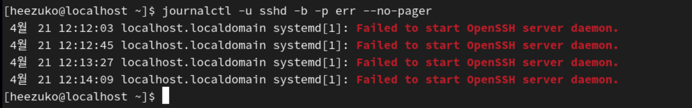
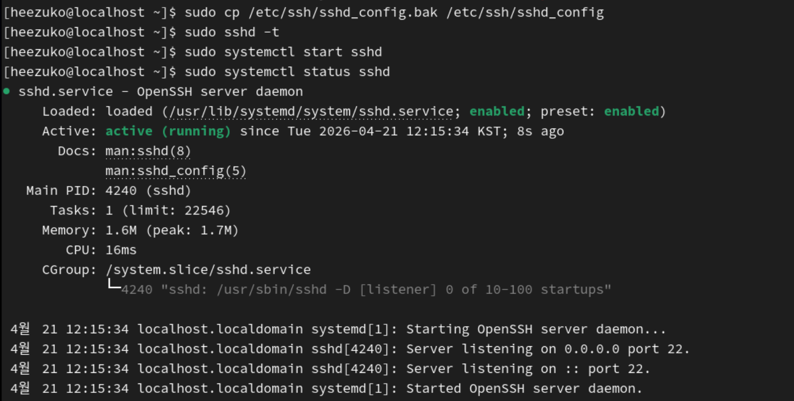
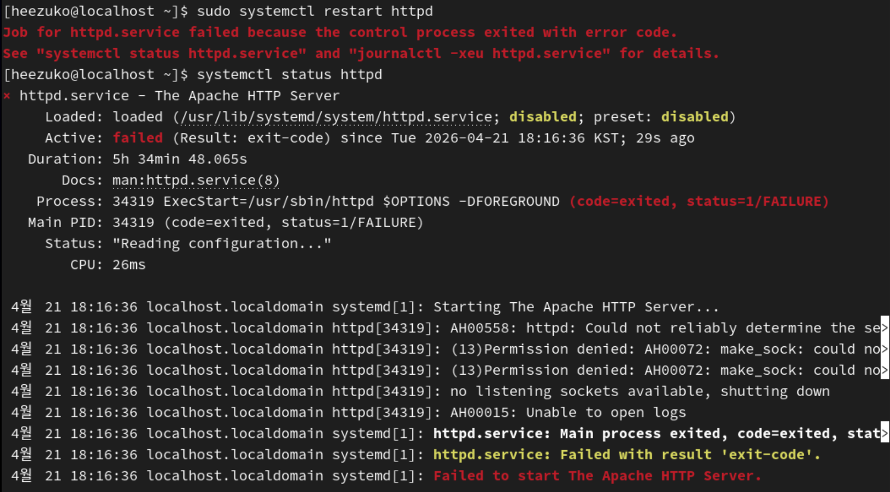
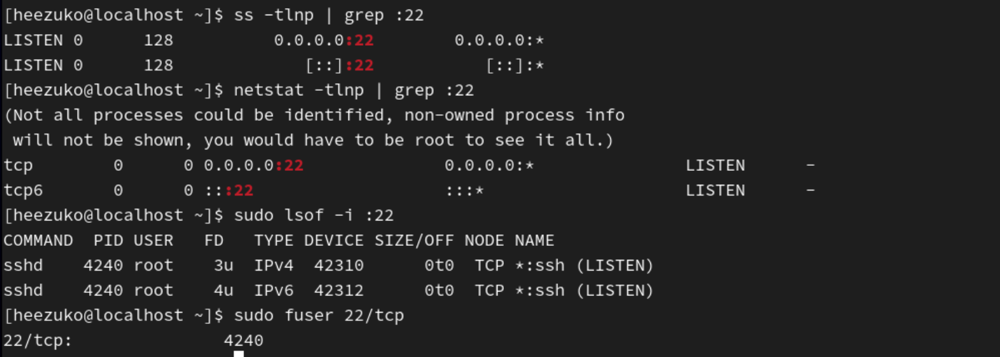
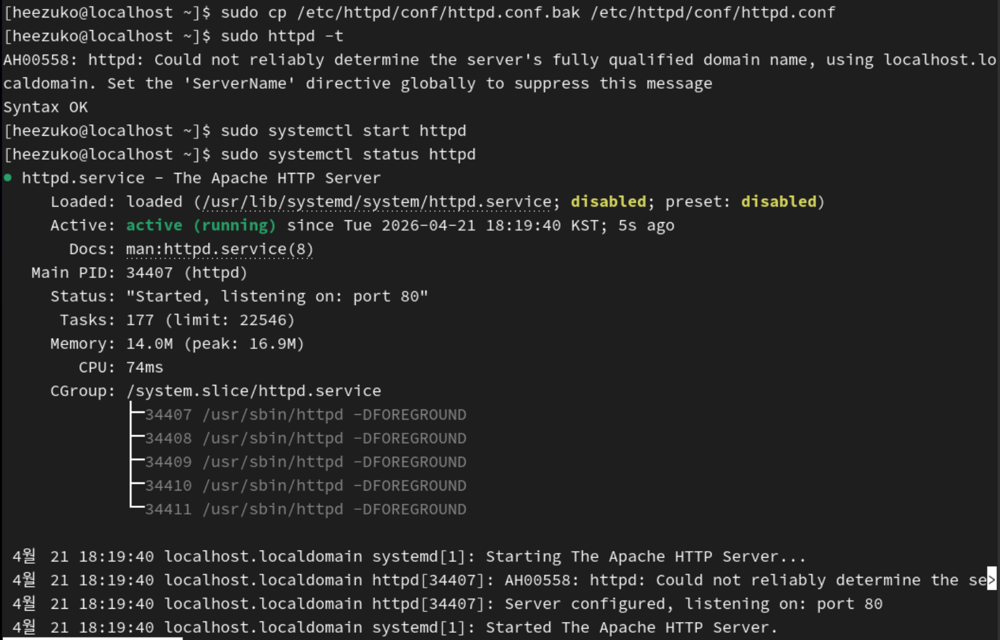
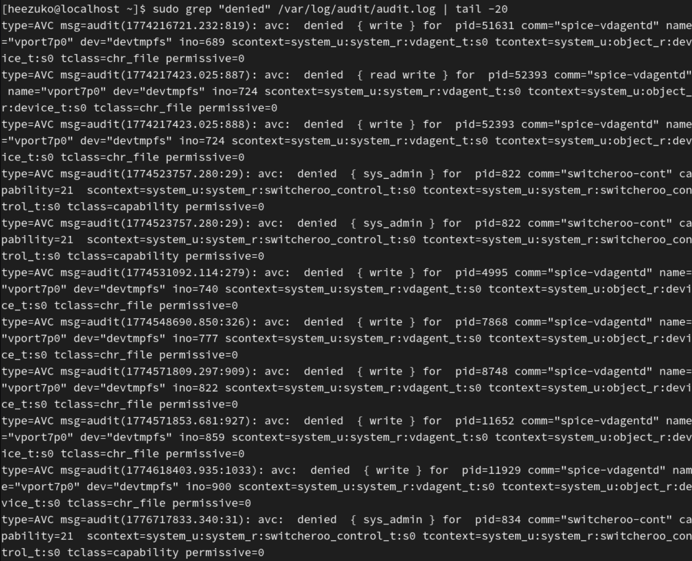

## 서비스 장애 분석을 위한 로그 확인

### 1. 서비스 장애 분석 기본 흐름

서비스에 문제가 발생했을 때 체계적으로 접근하는 순서는 다음과 같다.

```
[장애 인지]
     │
     ▼
[서비스 상태 확인]
systemctl status <service>
     │
     ├── active(running) → 다른 원인 탐색
     │
     └── failed / inactive
          │
          ▼
     [저널 로그 확인]
     journalctl -u <service> -b --no-pager
          │
          ▼
     [오류 메시지 분석]
     - 설정 파일 오류?
     - 포트 충돌?
     - 권한 문제?
     - SELinux 차단?
          │
          ▼
     [원인 수정 → 서비스 재시작]
     systemctl start <service>
          │
          ▼
     [재확인 및 자동 시작 설정]
     systemctl enable <service>
```

### 2. systemctl로 서비스 상태 확인

#### 2-1. 서비스 상태 확인

```bash
# 서비스 상태 요약 확인
systemctl status sshd

# 실행 중인 서비스 목록
systemctl list-units --type=service --state=running

# 실패한 서비스 목록 (장애 발생 서비스 한눈에 파악)
systemctl list-units --type=service --state=failed

# 모든 서비스 상태 목록
systemctl list-units --type=service
```



- `systemctl status sshd` 실행 결과 (정상)
- 패키지 캐시 자동 업데이트 서비스 실패

#### 2-2. `systemctl status` 출력 해석

```
● sshd.service - OpenSSH server daemon
     Loaded: loaded (/usr/lib/systemd/system/sshd.service; enabled; preset: enabled)
     Active: active (running) since Tue 2026-04-21 06:39:50 KST; 1h 38min ago
       Docs: man:sshd(8)
             man:sshd_config(5)
   Main PID: 1020 (sshd)
      Tasks: 1 (limit: 22546)
     Memory: 3.1M (peak: 3.2M)
        CPU: 7ms
     CGroup: /system.slice/sshd.service
             └─1020 "sshd: /usr/sbin/sshd -D [listener] 0 of 10-100 startups"

 4월 21 06:39:50 localhost.localdomain systemd[1]: Starting OpenSSH server daemon...
 4월 21 06:39:50 localhost.localdomain sshd[1020]: Server listening on 0.0.0.0 port 22.
```

| 항목       | 설명                                    |
| ---------- | --------------------------------------- |
| `Loaded`   | 유닛 파일 로드 여부 및 자동 실행 설정   |
| `Active`   | 현재 실행 상태 (active/inactive/failed) |
| `Docs`     | 참고 매뉴얼                             |
| `Main PID` | 메인 프로세스 ID                        |
| `CGroup`   | systemd가 관리하는 프로세스 계층 구조   |
| 하단 로그  | 최근 저널 로그 일부 (약 10줄)           |

#### 2-3. 서비스 상태(Active)의 종류

| 상태               | 의미                      |
| ------------------ | ------------------------- |
| `active (running)` | 정상 실행 중              |
| `active (exited)`  | 정상 종료됨 (원샷 서비스) |
| `inactive (dead)`  | 실행 안 됨                |
| `failed`           | 오류로 종료됨             |
| `activating`       | 시작 중                   |
| `deactivating`     | 종료 중                   |

### 3. journalctl로 장애 원인 추적

#### 3-1. 장애 서비스 로그 집중 분석

```bash
# 현재 부팅 이후 특정 서비스 전체 로그
journalctl -u sshd -b --no-pager

# 에러 레벨 이상만 필터
journalctl -u sshd -b -p err --no-pager

# 마지막 10줄만 확인
journalctl -u sshd -n 10 --no-pager

# 서비스 시작 실패 직전 로그 확인
journalctl -u sshd --since "10 minutes ago"
```



- 에러 레벨 이상의 로그 존재 X
- sshd 관련 로그 최근 10줄 확인

#### 3-2. `--no-pager` 옵션의 중요성

스크립트나 파이프에서 사용할 때 페이저(less) 없이 바로 출력 가능

`journalctl`을 그냥 실행하면 결과가 less 프로그램으로 열림  
-> less는 사람이 키보드 누르길 기다리는 프로그램이라서 스크립트가 멈춰버림  
-> 그래서 파이프가 제대로 안 돌아감

**`--no-pager`**: less 쓰지 말고 그냥 터미널로 바로 출력해라!

```bash
# 파이프와 함께 사용 시 필수
journalctl -u httpd -b --no-pager | grep -i "error"
journalctl -u httpd -b --no-pager | tail -30
```

### 4. 실습: sshd 장애 시뮬레이션

#### 4-1. 의도적인 설정 오류 유발

```bash
# 설정 파일 백업
sudo cp /etc/ssh/sshd_config /etc/ssh/sshd_config.bak

# 잘못된 설정 추가 (포트 번호 오류)
sudo vi /etc/ssh/sshd_config
# Port 99999  ← 유효하지 않은 포트 번호 추가

# sshd 재시작 시도
sudo systemctl restart sshd
```


잘못된 포트 설정 후 sshd 재시작 실패

#### 4-2. 장애 상태 확인

```bash
# 실패 상태 확인
systemctl status sshd
```


`systemctl status sshd` 실패 출력

#### 4-3. 저널 로그로 상세 원인 파악

```bash
# 저널에서 상세 에러 확인
journalctl -u sshd -b -p err --no-pager
```



#### 4-4. 복구

```bash
# 설정 파일 복구
sudo cp /etc/ssh/sshd_config.bak /etc/ssh/sshd_config

# 설정 파일 문법 검사
sudo sshd -t

# 정상 확인 후 재시작
sudo systemctl start sshd
sudo systemctl status sshd
```


설정 복구 후 sshd 정상 재시작 확인

### 5. 실습: httpd 장애 시뮬레이션

#### 5-1. httpd 설치 및 장애 유발

```bash
# httpd 설치 (없는 경우)
sudo dnf install -y httpd

# 설정 파일 백업
sudo cp /etc/httpd/conf/httpd.conf /etc/httpd/conf/httpd.conf.bak

# 이미 사용 중인 포트로 변경 (포트 충돌 유발)
sudo vi /etc/httpd/conf/httpd.conf
# Listen 22  ← sshd가 사용 중인 포트로 변경

# httpd 재시작
sudo systemctl restart httpd
```

#### 5-2. 장애 로그 분석

```bash
# 상태 확인
systemctl status httpd

# 저널 로그 확인
journalctl -u httpd -b --no-pager

# httpd 전용 오류 로그도 확인
sudo tail -30 /var/log/httpd/error_log
```


httpd 포트 충돌로 인한 장애 로그

#### 5-3. 포트 사용 현황 확인

```bash
# 포트 사용 현황 확인 (어떤 프로세스가 포트를 점유 중인지)
ss -tlnp | grep :22
netstat -tlnp | grep :22

# 또는 특정 포트를 사용 중인 프로세스 확인
sudo lsof -i :22
sudo fuser 22/tcp
```


포트 점유 프로세스 확인 (sshd)

#### 5-4. 복구

```bash
# 설정 복구
sudo cp /etc/httpd/conf/httpd.conf.bak /etc/httpd/conf/httpd.conf

# 설정 문법 검사
sudo httpd -t

# 재시작
sudo systemctl start httpd
sudo systemctl status httpd
```


설정 복구 후 httpd 정상 재시작 확인

### 6. SELinux 관련 장애 분석

SELinux가 활성화된 RHEL 환경에서 **SELinux 정책이 서비스를 차단**할 수 있다.

#### 6-1. SELinux 상태 확인

```bash
# SELinux 현재 모드 확인
getenforce
# Enforcing / Permissive / Disabled

# 상세 상태
sestatus
```

#### 6-2. SELinux 차단 로그 확인

```bash
# audit 로그에서 SELinux 거부 기록 확인
sudo grep "denied" /var/log/audit/audit.log | tail -20

# ausearch로 더 읽기 쉽게 확인
sudo ausearch -m avc -ts recent

# sealert로 분석 및 해결 방법 제안 (setroubleshoot 패키지 필요)
sudo sealert -a /var/log/audit/audit.log
```


audit.log에서 SELinux AVC denied 메시지 확인

#### 6-3. SELinux 문제 임시 해결 (Permissive 모드)

```bash
# 임시로 Permissive 모드 전환 (재부팅 시 초기화)
sudo setenforce 0
getenforce  # Permissive 확인

# 서비스 재시작 후 동작 확인
sudo systemctl start <service>

# 영구 변경은 /etc/selinux/config 수정 (권장하지 않음)
```

⚠️ Permissive 모드는 문제 원인 파악 후 반드시 `Enforcing`으로 복구해야 한다.

```bash
sudo setenforce 1
```

---

#### 6-4. SELinux 컨텍스트 확인 및 수정

```bash
# 파일의 SELinux 컨텍스트 확인
ls -Z /var/www/html/
ls -Z /etc/httpd/

# 컨텍스트 복원 (기본값으로)
sudo restorecon -Rv /var/www/html/
```

---

### 7. 로그 기반 장애 패턴 정리

#### 7-1. 자주 보이는 오류 메시지 유형

| 오류 키워드                 | 가능한 원인                 | 확인 방법                              |
| --------------------------- | --------------------------- | -------------------------------------- |
| `Permission denied`         | 파일 권한 문제 또는 SELinux | `ls -l`, `ls -Z`                       |
| `Address already in use`    | 포트 충돌                   | `ss -tlnp`                             |
| `No such file or directory` | 설정 파일 경로 오류         | 설정 파일 확인                         |
| `Connection refused`        | 서비스 미실행 또는 방화벽   | `systemctl status`, `firewall-cmd`     |
| `AVC denied`                | SELinux 정책 차단           | `ausearch -m avc`                      |
| `syntax error`              | 설정 파일 문법 오류         | 해당 서비스 `-t` 옵션                  |
| `OOM` / `Out of memory`     | 메모리 부족                 | `free -h`, `journalctl -k \| grep oom` |

---

#### 7-2. 장애 분석 명령어 종합 체크리스트

```bash
# 1. 전체 실패 서비스 목록
systemctl list-units --state=failed

# 2. 특정 서비스 상태
systemctl status <service>

# 3. 저널 로그 (에러 이상)
journalctl -u <service> -b -p err --no-pager

# 4. SELinux 차단 여부
ausearch -m avc -ts recent 2>/dev/null | tail -20

# 5. 포트 점유 현황
ss -tlnp

# 6. 방화벽 규칙 확인
firewall-cmd --list-all

# 7. 디스크 공간 확인 (로그/데이터 디스크 풀)
df -h

# 8. OOM 발생 여부
journalctl -k --since today | grep -i "oom\|out of memory"
```
