## CPU·메모리·디스크·프로세스 사용량 점검 & 시스템 성능 측정 및 하드웨어 리소스 점검 도구 활용

### 1. 시스템 자원 모니터링 개요

시스템 성능 점검의 4대 핵심 영역:

```
┌────────────────────────────────────────────────────────┐
│                  시스템 성능 4대 영역                       │
│                                                        │
│   ┌──────────┐  ┌──────────┐  ┌──────────┐  ┌────────┐ │
│   │   CPU    │  │  Memory  │  │   Disk   │  │  Net   │ │
│   │          │  │          │  │          │  │        │ │
│   │ top      │  │ free     │  │ df       │  │ ss     │ │
│   │ mpstat   │  │ vmstat   │  │ du       │  │ sar    │ │
│   │ sar      │  │ sar      │  │ iostat   │  │ ip     │ │
│   └──────────┘  └──────────┘  └──────────┘  └────────┘ │
└────────────────────────────────────────────────────────┘
```

### 2. CPU 사용량 점검

#### 2-1. `top` - 실시간 프로세스 및 CPU 모니터링

`top`: 실시간으로 시스템 상태를 보여주는 모니터링 명령어  
-> CPU / 메모리 / 프로세스를 실시간으로 보여주는 작업 관리자 역할

```bash
# 기본 실행 (1초마다 갱신)
top

# 갱신 주기 변경 (0.5초마다)
top -d 0.5

# 특정 사용자 프로세스만 표시
top -u nginx

# 배치 모드 (스크립트에서 사용)
top -b -n 1 | head -20
```

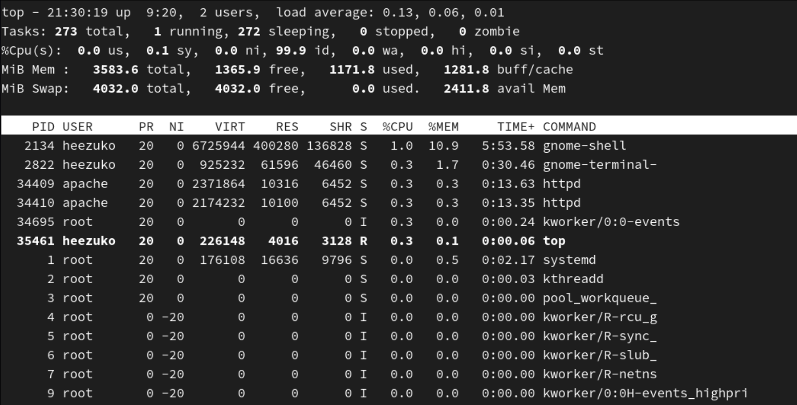

**`top` 화면 상단 해석:**
| 항목 | 설명 |
| -------------- | ------------------------------------------- |
| `load average` | 1분/5분/15분 평균 부하 (CPU 코어 수와 비교) |
| `us` (user) | 사용자 프로세스 CPU 사용률 |
| `sy` (system) | 커널 CPU 사용률 |
| `id` (idle) | CPU 유휴 상태 (높을수록 여유 있음) |
| `wa` (iowait) | I/O 대기 시간 비율 (높으면 디스크 병목) |
| `si` (softirq) | 소프트웨어 인터럽트 |

**`top` 내부 명령어:**

| 키  | 기능                      |
| --- | ------------------------- |
| `1` | CPU 코어별 사용률 표시    |
| `M` | 메모리 사용량 순 정렬     |
| `P` | CPU 사용량 순 정렬 (기본) |
| `k` | 프로세스 종료 (kill)      |
| `q` | 종료                      |
| `h` | 도움말                    |

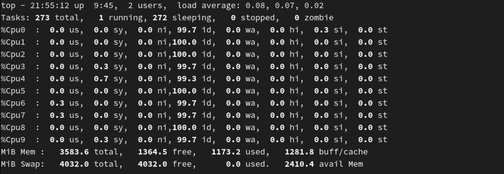
`top` 실행 화면 (CPU 코어별 `1` 키 입력 후)

#### 2-2. `mpstat` - CPU 코어별 상세 통계

```bash
# sysstat 패키지 설치 (없는 경우)
sudo dnf install -y sysstat

# 전체 CPU 요약
mpstat

# 1초마다 5번 출력
mpstat 1 5

# 코어별 상세 출력 (1초 간격으로 CPU 코어별 상태를 3번 보여줌)
mpstat -P ALL 1 3
```

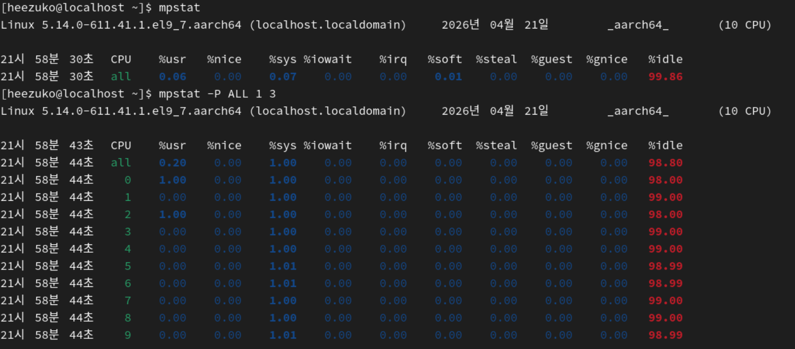

- `mpstat` -> CPU 전체 평균 사용률 1회 출력
- `mpstat -P ALL 1 3` -> 모든 CPU 코어별 상태 출력

#### 2-3. `sar` - 시스템 활동 보고서 (CPU)

```bash
# 현재 CPU 사용률 1초 간격 5회
sar -u 1 5

# 저장된 기록에서 어제 CPU 사용 이력 조회
sar -u -f /var/log/sa/sa$(date -d yesterday +%d)

# 오늘 하루 CPU 사용 이력
sar -u
```

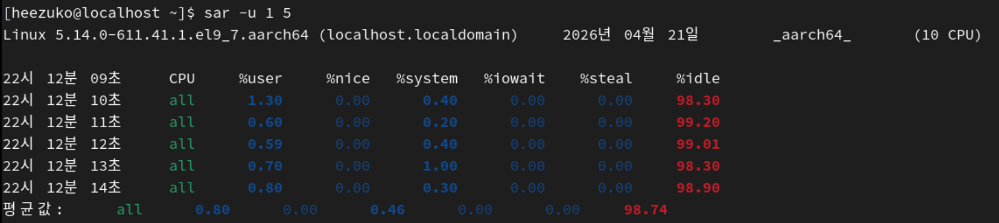
`sar -u 1 5` CPU 사용률 측정 결과

### 3. 메모리 사용량 점검

#### 3-1. `free` - 메모리 현황 요약

```bash
# 사람이 읽기 쉬운 단위로 출력
free -h

# MB 단위
free -m

# 1초마다 갱신 (watch 조합)
watch -n 1 free -h
```

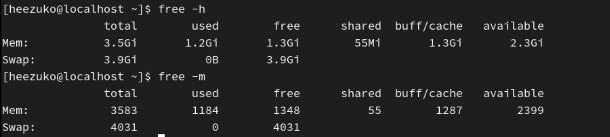

| 컬럼         | 설명                                      |
| ------------ | ----------------------------------------- |
| `total`      | 전체 물리 메모리                          |
| `used`       | 사용 중인 메모리                          |
| `free`       | 완전히 미사용 메모리                      |
| `buff/cache` | 버퍼/캐시로 사용 중 (필요 시 회수 가능)   |
| `available`  | 실제로 사용 가능한 메모리 **(핵심 지표)** |
| `Swap used`  | 스왑 사용량 (높으면 메모리 부족 신호)     |

💡 `free` 값보다 `available` 값이 실제 사용 가능 메모리다.  
`buff/cache`는 OS가 성능을 위해 사용하는 것으로, 부족하면 자동 반환된다.

#### 3-2. `vmstat` - 가상 메모리 통계

```bash
# 2초마다 5번 출력
vmstat 2 5

# 메모리, 디스크 I/O 포함 상세 출력
vmstat -s

# 디스크별 통계
vmstat -d
```

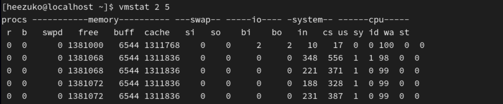

| 컬럼 | 설명                                          |
| ---- | --------------------------------------------- |
| `r`  | 실행 대기 중인 프로세스 수 (CPU 포화 지표)    |
| `b`  | I/O 대기 중인 프로세스 수                     |
| `si` | 스왑 입력 (메모리 → 스왑, 높으면 메모리 부족) |
| `so` | 스왑 출력 (스왑 → 메모리)                     |
| `bi` | 블록 디바이스 읽기 (blocks/s)                 |
| `bo` | 블록 디바이스 쓰기 (blocks/s)                 |
| `wa` | I/O 대기 CPU 비율                             |

#### 3-3. 메모리 사용 상위 프로세스 확인

```bash
# 메모리 사용량 상위 10개 프로세스
ps aux --sort=-%mem | head -11

# 또는 top에서 M 키 입력
```

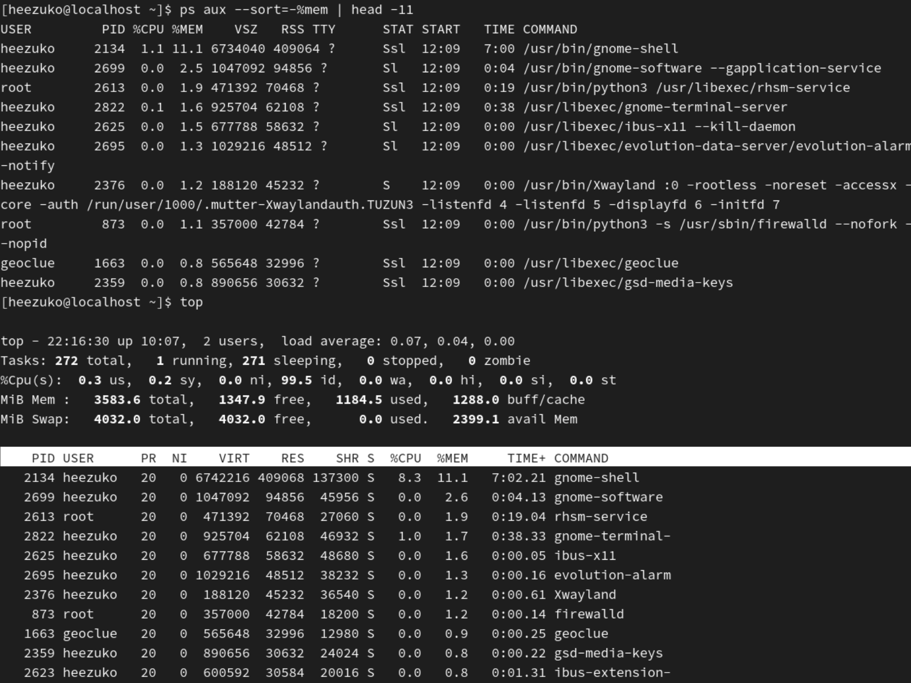

### 4. 디스크 사용량 점검

#### 4-1. `df` - 파일시스템 사용량

```bash
# 사람이 읽기 쉬운 단위
df -h

# 파일시스템 타입 포함
df -hT

# 특정 디렉토리의 마운트 포인트 확인
df -h /var/log
```

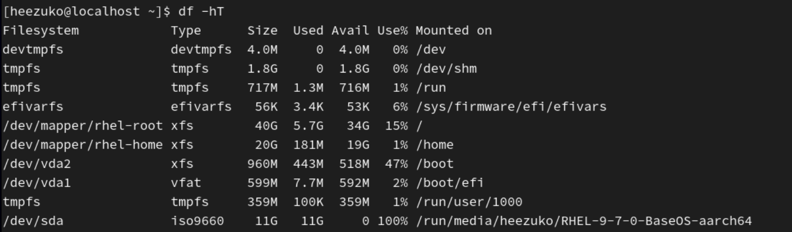
`df -hT` 파일시스템 사용량 확인

⚠️ `Use%`가 **85% 이상**이면 용량 부족 경고 상태로 판단

#### 4-2. `du` - 디렉토리/파일 크기 확인

```bash
# 현재 디렉토리 하위 총 사용량
du -sh *

# 특정 디렉토리 크기
du -sh /var/log

# 하위 디렉토리별 사용량 (깊이 1단계)
du -h --max-depth=1 /var/

# 크기 순 정렬 (상위 10개)
du -h /var/ 2>/dev/null | sort -rh | head -10
```

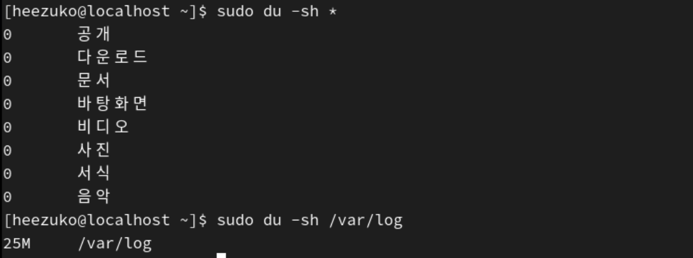

- `du -sh *` 현재 home 디렉토리 내 하위 디렉토리들에는 파일이 아무것도 없어서 0
- `du -sh /var/log/` 로그 디렉토리 크기 확인: 25M

#### 4-3. `iostat` - 디스크 I/O 통계

```bash
# 기본 출력
iostat

# 2초마다 5번, 확장 통계
iostat -x 2 5

# 특정 디바이스만
iostat -x sda 1 5
```

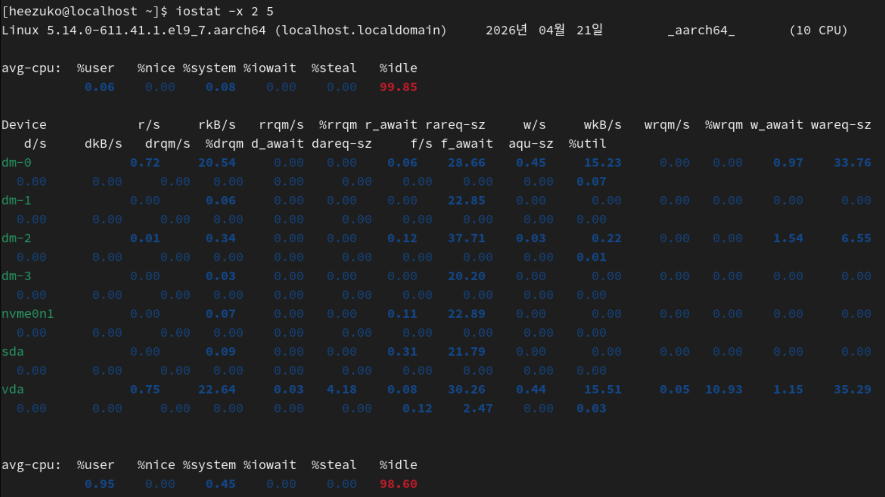

| 컬럼    | 설명                                        |
| ------- | ------------------------------------------- |
| `r/s`   | 초당 읽기 요청 수                           |
| `w/s`   | 초당 쓰기 요청 수                           |
| `rMB/s` | 초당 읽기 데이터량                          |
| `wMB/s` | 초당 쓰기 데이터량                          |
| `await` | 평균 I/O 대기 시간 (ms, 높으면 디스크 병목) |
| `%util` | 디스크 사용률 (100%에 가까우면 포화 상태)   |

### 5. 프로세스 모니터링

#### 5-1. `ps` - 프로세스 스냅샷

```bash
# 실행 중인 모든 프로세스 (BSD 스타일)
ps aux

# 전체 프로세스 tree 구조
ps auxf

# CPU 사용량 상위 10개
ps aux --sort=-%cpu | head -11

# 메모리 사용량 상위 10개
ps aux --sort=-%mem | head -11

# 특정 프로세스 검색
ps aux | grep httpd
pgrep -la sshd
```

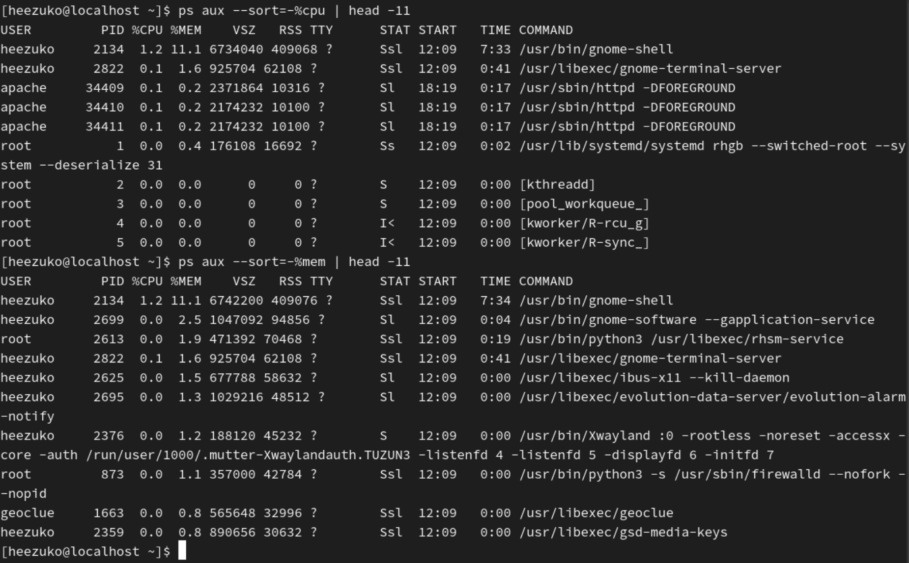

- `ps aux --sort=-%mem | head -11` 메모리 사용량 상위 프로세스 확인
- `ps aux --sort=-%cpu | head -11` CPU 사용량 상위 프로세스 확인

| 컬럼      | 설명                                   |
| --------- | -------------------------------------- |
| `USER`    | 프로세스 소유자                        |
| `PID`     | 프로세스 ID                            |
| `%CPU`    | CPU 사용률                             |
| `%MEM`    | 메모리 사용률                          |
| `VSZ`     | 가상 메모리 크기 (KB)                  |
| `RSS`     | 실제 물리 메모리 사용량 (KB)           |
| `STAT`    | 프로세스 상태 (R:실행, S:수면, Z:좀비) |
| `COMMAND` | 실행 명령어                            |

#### 5-2. 좀비(Zombie) 프로세스 확인

**좀비 프로세스**: 실행은 종료됐지만 부모 프로세스가 종료 상태를 수거하지 않아  
프로세스 테이블에 남아 있는 상태. 소량은 무해하지만 대량 발생 시 PID 고갈 위험이 있다.

```bash
# 좀비 프로세스 확인
ps aux | grep -w 'Z'

# 또는
ps aux | awk '$8=="Z"'
```


프로세스 목록에서 문자 Z를 포함한 걸 찾았는데, grep 자기 자신만 나오고 좀비 프로세스는 없음!

#### 5-3. `pstree` - 프로세스 트리 시각화

```bash
# 전체 프로세스 트리
pstree

# PID 포함
pstree -p

# 특정 사용자 프로세스
pstree -u nginx
```

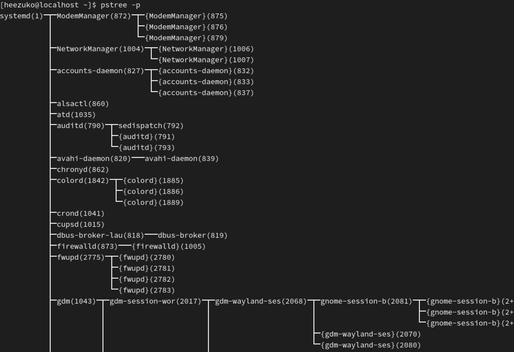
`pstree -p` 프로세스 간의 부모-자식 관계 확인

#### 5-4. `ps aux`와 `pstree` 차이

| 명령어   | 특징               |
| -------- | ------------------ |
| `ps aux` | 리스트 형태 (평면) |
| `pstree` | 계층 구조 (트리)   |

### 6. 종합 모니터링 도구

#### 6-1. `htop` - 향상된 대화형 프로세스 뷰어

```bash
# 설치
sudo dnf install -y htop

# 실행
htop
```

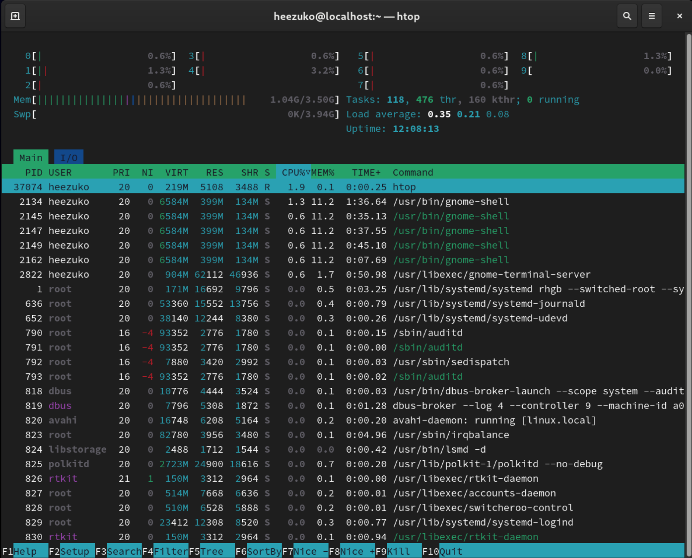

**`top` 대비 장점:**

- 색상으로 구분된 직관적 인터페이스
- 마우스 클릭 지원
- CPU/메모리 막대 그래프
- 프로세스 트리 보기 (`F5`)
  - 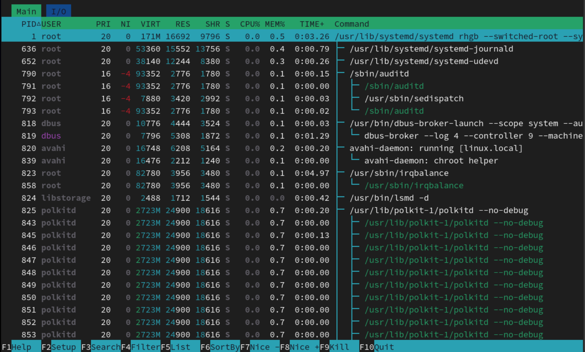
- 손쉬운 프로세스 필터링 (`F4`)
  - 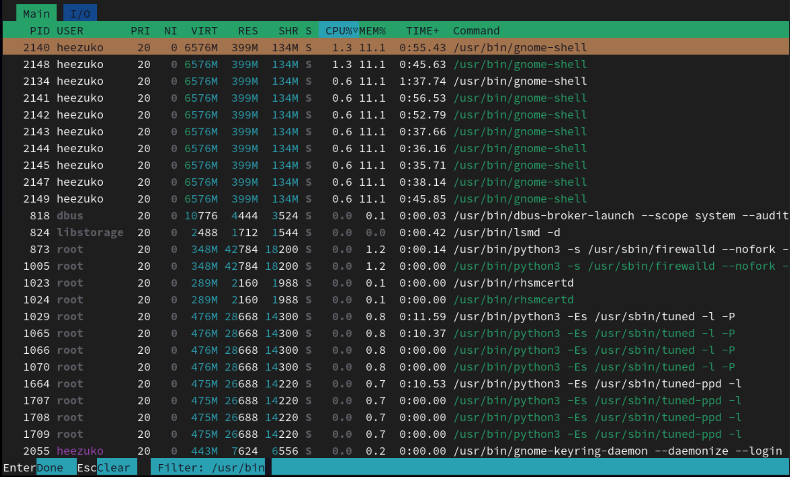

#### 6-2. `sar` - 종합 성능 이력 기록 및 조회

`sar`는 `sysstat` 패키지에 포함되어 있으며, **성능 데이터를 시간별로 기록하고 나중에 조회**할 수 있다.

```bash
# sysstat 활성화 (데이터 수집 시작)
sudo systemctl enable --now sysstat

# CPU 사용률 이력
sar -u

# 메모리 이력
sar -r

# 디스크 I/O 이력
sar -b

# 네트워크 이력
sar -n DEV

# 스왑 사용 이력
sar -S

# 특정 날짜 이력 파일 지정
sar -u -f /var/log/sa/sa15    # 15일자 데이터
```

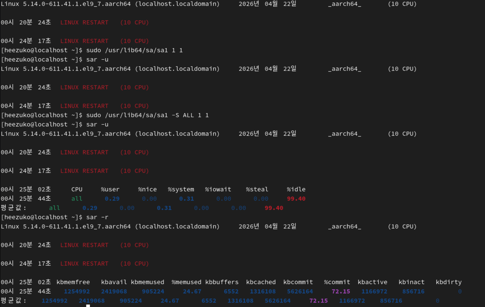

- 처음에는 재부팅 내역만 나옴... 활성화 이후 10분 간격으로 수집하기 때문!!
- 그래서 수동으로 22일 파일을 생성 후 성능 이력을 확인할 수 있었음

### 7. 하드웨어 리소스 점검 도구

#### 7-1. CPU 하드웨어 정보

```bash
# CPU 상세 정보
lscpu

# /proc/cpuinfo로 물리적 정보 확인
cat /proc/cpuinfo | grep -E "processor|model name|cpu cores|siblings" | head -20

# 소켓/코어/스레드 구성 요약
lscpu | grep -E "Socket|Core|Thread|CPU\(s\)"
```

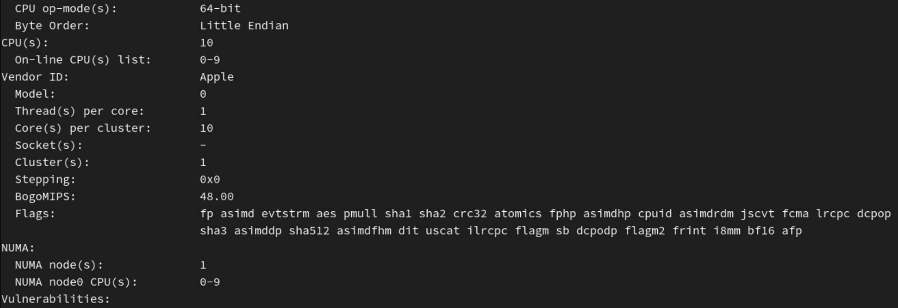
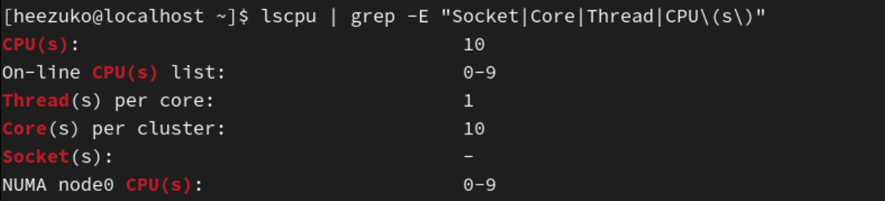
`lscpu` CPU 하드웨어 정보 확인

- `CPU(s): 10` 논리 CPU 수 (= 소켓 × 코어 × 스레드)
- `Thread(s) per core: 1` 1코어 1스레드 -> 하이퍼스레딩 없음
- `Core(s) per cluster: 10` 물리 코어 수 (CPU 연산 유닛)
- `Socket(s): -` 소켓 없음 -> 단일 CPU 패키지

#### 7-2. 메모리 하드웨어 정보

```bash
# 메모리 슬롯 및 장착 정보 (root 권한 필요)
sudo dmidecode -t memory | grep -E "Size|Type|Speed|Locator" | grep -v "No Module"

# 총 물리 메모리
grep MemTotal /proc/meminfo

# 전체 메모리 정보
cat /proc/meminfo
```

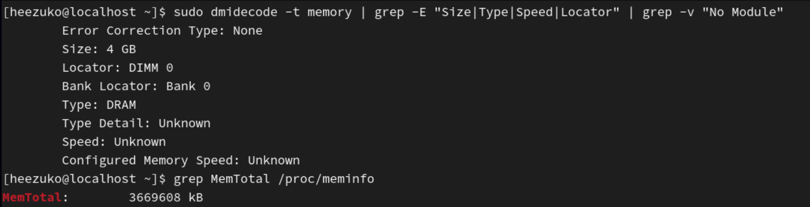

- `Size: 4 GB` 물리 RAM = 4GB
- `MemTotal: 3669608 kB` OS 인식 RAM ≈ 3.5GB
- 왜 0.5GB 정도 차이가 날까❓
  - 커널 예약 메모리 때문!
  - 리눅스는 부팅하면서 RAM 일부를 미리 가져감
    - 커널 코드
    - 드라이버
    - 페이지 캐시 구조
    - DMA 영역 등

#### 7-3. 디스크 하드웨어 정보

```bash
# 디스크 구조를 트리로 확인
lsblk
lsblk -o NAME,SIZE,TYPE,MOUNTPOINT,FSTYPE

# 디스크 상세 정보
sudo fdisk -l
```

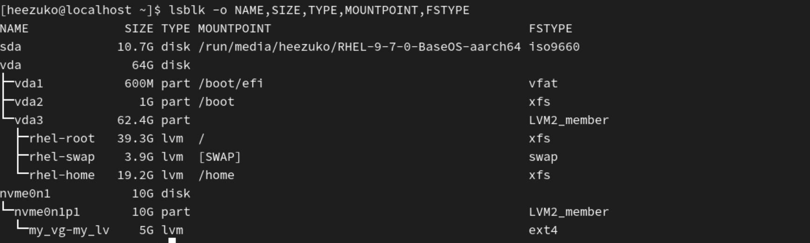

| 컬럼       | 의미            |
| ---------- | --------------- |
| NAME       | 디스크 이름     |
| SIZE       | 용량            |
| TYPE       | disk / part     |
| MOUNTPOINT | 어디에 연결됨   |
| FSTYPE     | 파일시스템 종류 |

```bash
# 디스크 S.M.A.R.T 상태 확인 (smartmontools 필요)
sudo dnf install -y smartmontools # 디스크 건강검진 프로그램 설치
sudo smartctl -a /dev/sda    # 정밀 건강검진 결과 전체 출력
sudo smartctl -H /dev/sda    # 상태만 빠르게 확인
```

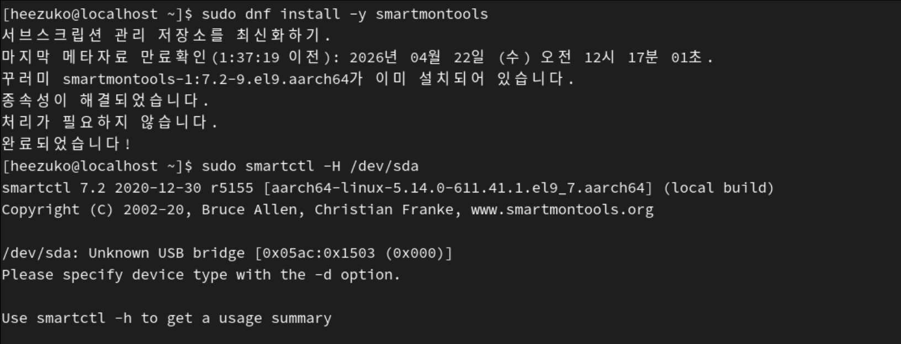

SMART는 원래 SATA/SAS 디스크용 기술임. 근데 지금 환경은 Mac 위 VM으로 실제 물리 HDD가 아니므로 **SMART 명령을 직접 전달 못함.**

VM/가상디스크 구조에서는 디스크가 실제로 이렇게 보임

```
물리 스토리지 → 하이퍼바이저 → SCSI 가상 디스크 → Linux
```

그래서 `-d scsi`로 scsi 타입으로 지정해주면 디스크 헬스 체크가 가능!!

```
sudo smartctl -H -d scsi /dev/sda
```

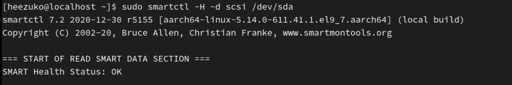

#### 7-4. 전체 하드웨어 목록

```bash
# 전체 하드웨어 요약
sudo dmidecode | grep -E "Product|Manufacturer|Version" | head -20

# PCI 장치 목록
lspci

# USB 장치 목록
lsusb

# 네트워크 인터페이스 정보
ip link show
ip addr show

# 네트워크 인터페이스 상세 (속도, 듀플렉스)
sudo ethtool eth0
```

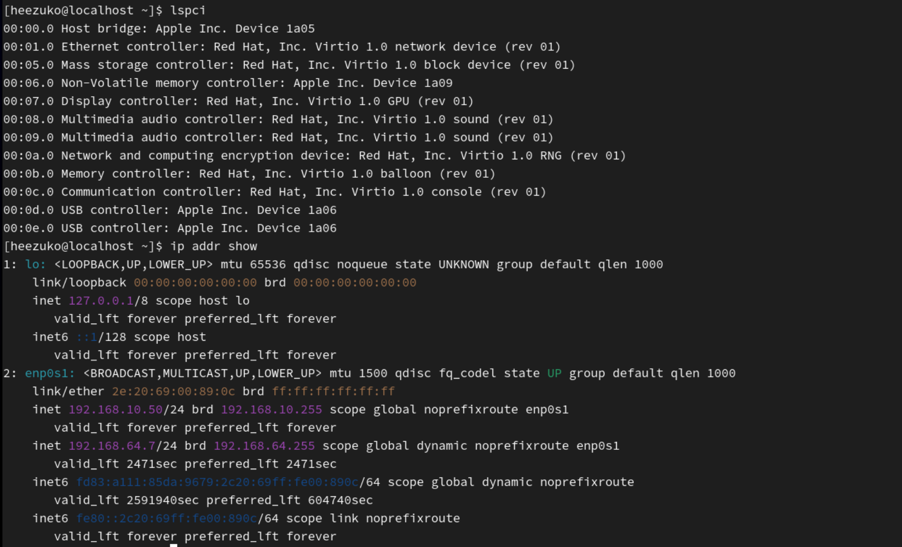

- `lspci` Mac(M칩) → 가상화 → RHEL VM → Virtio 장치 구조의 VM 환경
- `ip addr show` 네트워크 인터페이스: enp0s1
- 왜 IP가 2개일까❓
  - VM 네트워크는 보통 두 개 네트워크가 동시에 붙음
    IP | 의미 |
    --- | ---- |
    192.168.64.7 | NAT 네트워크 (인터넷용) |
    192.168.10.50 | Host-only / 내부망 |

---

### 8. 성능 측정 도구 활용

#### 8-1. `stress` / `stress-ng` - 부하 테스트 도구

```bash
# 설치
sudo dnf install -y stress-ng

# CPU 4코어 부하 30초간
stress-ng --cpu 4 --timeout 30s

# 메모리 2GB 부하 테스트
stress-ng --vm 2 --vm-bytes 1G --timeout 30s

# 디스크 I/O 부하
stress-ng --io 4 --timeout 30s
```

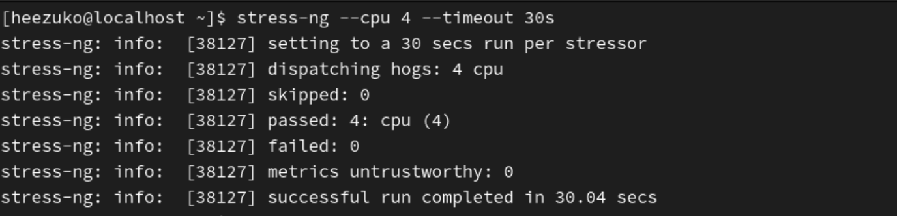
부하 30초 동안 커널 panic, 시스템 멈춤, 프로세스 kill, 리소스 부족 없음  
-> CPU 부하 테스트 정상 통과

#### 8-2. `uptime` - 시스템 가동 시간 및 부하

```bash
# 현재 가동 시간 및 부하 평균
uptime
```

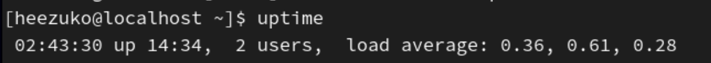

| 항목           | 설명                                       |
| -------------- | ------------------------------------------ |
| `up 14:34`     | 마지막 재부팅 이후 가동 시간 (14시간 34분) |
| `2 users`      | 현재 로그인된 사용자 수                    |
| `load average` | 1분/5분/15분 평균 실행 대기 프로세스 수    |

💡 **부하 평균 해석 기준**: CPU 코어 수와 동일한 값이면 100% 사용 중.  
`lscpu`로 확인했을 때 `CPU(s): 10`이었으므로 `load average: 10.0`이면 포화 상태, 그 이상이면 과부하.

#### 8-3. `/proc` 파일시스템으로 실시간 정보 확인

```bash
# CPU 정보
cat /proc/cpuinfo

# 메모리 정보
cat /proc/meminfo

# 시스템 통계 (부팅 이후 누적)
cat /proc/stat

# 디스크 I/O 통계
cat /proc/diskstats

# 네트워크 통계
cat /proc/net/dev

# 현재 실행 중인 프로세스 수
ls /proc | grep -E '^[0-9]+$' | wc -l
```

---

#### ✔️ 성능 점검 명령어 모음

```bash
# ─── CPU ───────────────────────────────────
top / htop                    # 실시간 프로세스 및 CPU 확인
mpstat -P ALL 1 3             # 코어별 CPU 사용률
sar -u 1 5                    # CPU 이력 측정
uptime                         # 부하 평균 확인

# ─── Memory ────────────────────────────────
free -h                        # 메모리 요약
vmstat 2 5                     # 가상 메모리 통계
ps aux --sort=-%mem | head -6  # 메모리 상위 프로세스
cat /proc/meminfo              # 상세 메모리 정보

# ─── Disk ──────────────────────────────────
df -hT                         # 파일시스템 사용량
du -sh /var/log/*              # 디렉토리별 사용량
iostat -x 2 3                  # 디스크 I/O 통계
lsblk                          # 블록 디바이스 목록

# ─── Process ───────────────────────────────
ps aux --sort=-%cpu | head -11 # CPU 상위 프로세스
pstree -p                      # 프로세스 트리
ps aux | awk '$8=="Z"'         # 좀비 프로세스 확인

# ─── Hardware ──────────────────────────────
lscpu                          # CPU 하드웨어 정보
sudo dmidecode -t memory       # 메모리 슬롯 정보
lsblk / sudo fdisk -l         # 디스크 정보
lspci                          # PCI 장치 목록
```
