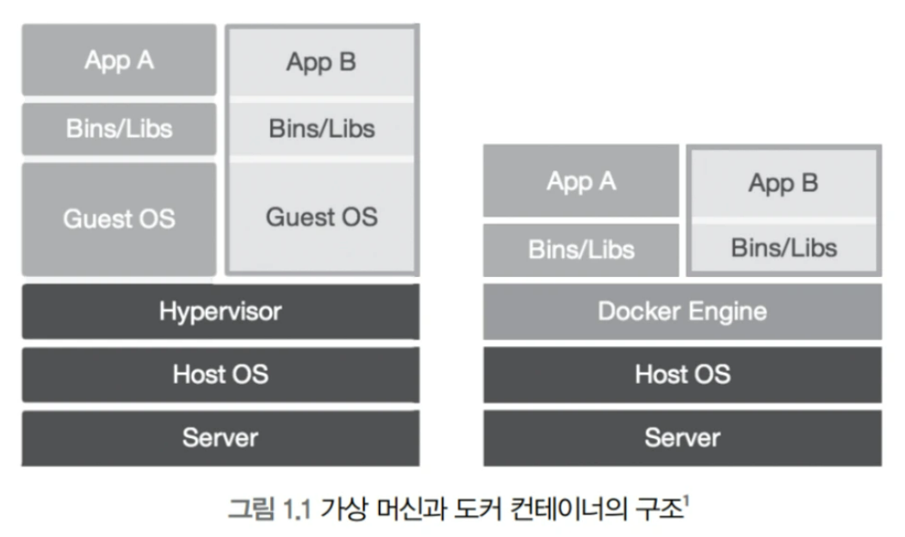

# Week 8

PR 여부: X
진행 상태: 진행중

## Week 8 : 컨테이너 기초

<aside>

컨테이너와 가상머신의 차이 이해, Docker와 Podman의 개념 및 기본 사용법, 이미지 검색·다운로드·삭제·관리, 컨테이너 실행·중지·접속 실습, 포트 매핑·볼륨 연결·기본 네트워크 설정

</aside>

# 1. 컨테이너 vs 가상머신



## 전통적인 가상화 방식: 가상머신(VM-Virtual Machine)

가상 머신은 하나의 물리적 서버(호스트) 위에 여러 개의 독립된 운영체제(OS)를 통째로 올리는 기술이다.

VMware나 VirtualBox 같은 도구를 사용하면 VM을 구성할 수 있다.

## VM의 구조

VM의 구조는 여러 층으로 이루어진다.

- 서버(Server)는 물리적인 하드웨어이다.
- 호스트 OS(Host OS)는 서버에 설치된 기본 운영체제이다.
- 하이퍼바이저(Hypervisor)는 호스트 OS 위에서 VM을 생성하고 관리하는 가상화 소프트웨어이다.
- 게스트 OS(Guest OS)는 각 VM이 독립적으로 가지는 운영체제이다.
- 애플리케이션(App)은 각 게스트 OS 위에서 실행된다.

## VM의 장점과 단점

- 장점: 각 VM은 커널을 포함한 완전한 OS를 가지기 때문에 강한 격리를 제공한다. 또한 서로 다른 OS를 동시에 실행할 수 있다.
- 단점: 각 VM이 독립적인 OS를 포함하기 때문에 이미지 크기가 크고 실행 속도가 느리다. 하이퍼바이저를 거치면서 성능 손실이 발생한다.

## 현대적인 가상화 방식: 도커 컨테이너 (Docker Container)

도커 컨테이너는 하드웨어가 아닌 운영체제(OS) 수준에서 가상화를 수행하는 기술이다. 이 방식은 VM보다 가볍고 효율적이다.

## 컨테이너의 구조

컨테이너의 구조는 VM보다 단순하다.

- 서버(Server)는 물리적인 하드웨어이다.
- 호스트 OS(Host OS)는 서버에 설치된 운영체제이다.
- 도커 엔진(Docker Engine)은 호스트 OS 위에서 컨테이너를 생성하고 관리한다.
- 애플리케이션(App)은 실행에 필요한 라이브러리와 함께 컨테이너에 포함된다.

가장 중요한 특징은 게스트 OS가 존재하지 않는다는 점이다. 모든 컨테이너는 호스트 OS의 커널을 공유한다.

## 컨테이너의 장점과 단점

- 장점: 게스트 OS와 하이퍼바이저가 없기 때문에 성능 손실이 거의 없다. 이미지 크기가 작고 실행 속도가 빠르다.
- 단점: 호스트 OS의 커널을 공유하기 때문에 다른 OS 환경을 직접 실행하는 데 제한이 있다. 예를 들어 Windows 환경에서 Linux 컨테이너를 직접 실행하기는 어렵다.

>>중간에 Linux 환경(VM)을 하나 두면 가

## 차이 핵심


- VM: “OS를 여러 개 띄움”
- Container: “프로세스를 격리해서 실행”

<aside>

## 실전 사례로 보는 작동 방식

내 서버에 Ubuntu 환경을 실행하고자 할 때, 가상 머신 방식과 컨테이너 방식은 서로 다르게 동작한다.

## VM 방식

하이퍼바이저는 수 GB 크기의 Ubuntu 이미지(.iso)를 읽어온다.

하드웨어 자원을 가상으로 할당하고, Ubuntu 커널부터 부팅을 시작한다.

완전한 Ubuntu 운영체제가 부팅된 이후에야 애플리케이션을 설치하고 실행할 수 있다. 이 과정은 수십 초에서 수 분이 소요된다.

## 컨테이너 방식

도커 엔진은 수십 MB 크기의 Ubuntu 이미지를 읽어온다.

호스트 OS의 커널을 그대로 사용하면서 프로세스를 격리할 수 있는 공간인 컨테이너를 생성한다.

호스트에서 일반적인 프로세스를 실행하는 것과 유사하게 매우 빠르게 Ubuntu 환경이 실행된다. 이 과정은 수 초 이내에 완료된다.

## 핵심 정리

도커 컨테이너는 격리된 프로세스에 가깝다.

리눅스의 chroot, 네임스페이스(namespace), cgroup과 같은 기능을 사용하여 프로세스 단위의 격리 환경을 구성한다.

이 구조로 인해 컨테이너는 성능 손실이 거의 없이 실행된다.

</aside>

출처: [https://brunch.co.kr/@wikibook/87](https://brunch.co.kr/@wikibook/87)

---

# 2. Docker vs Podman

둘 다 컨테이너 실행 도구(컨테이너 엔진)

도커는 데몬 기반 아키텍처를 사용하는 반면, 포드맨은 루트 없는 컨테이너와 직접적인 커널 통신으로 더 안전한 데몬 없는 대안을 제공

*도커: 서비스 기반 vs podman: 프로세스 기반*

## Docker

Docker는 클라이언트-서버 모델을 가진 데몬 기반 아키텍처를 채택하고 있으며, 중앙 집중식 데몬 프로세스가 백그라운드에서 컨테이너 작업을 관리한다. 이 아키텍처는 중앙 집중식 컨테이너 관리를 제공하지만, 루트 권한으로 실행되는 데몬으로 인해 잠재적인 보안 위험을 초래한다. 

최근 Docker는 루트 없는 모드를 도입했지만, 이 기능은 원래 설계의 일부가 아니며 추가 구성이 필요하다.

- docker daemon(백그라운드 프로세스) 필요
- 클라이언트 → daemon → container 구조
- root 권한 기반

## Podman

반대로, Podman은 데몬 없는 아키텍처를 활용하여 리눅스 커널 및 컨테이너 런타임 인터페이스와 직접 통신한다. 이 디자인은 지속적인 백그라운드 프로세스의 필요성을 없애고 컨테이너가 독립적으로 작동할 수 있도록 하여 보안을 강화하고 시스템 오버헤드를 줄인다.

- 더 좁은 기본 권한 집합 (Docker의 14개에 비해 11개)[2](https://betterstack.com/community/guides/scaling-docker/podman-vs-docker/)
- daemon 없음 (각 컨테이너가 독립 프로세스)
- rootless 실행 가능
- 격리된 사용자 네임스페이스
- 직접 커널 통신
- 보안 측면에서 유리

+

Docker의 데몬 기반 아키텍처는 지속적인 백그라운드 프로세스 때문에 일반적으로 더 많은 시스템 자원을 소모한다. Podman의 데몬 없는 접근 방식은 일반적으로 더 낮은 자원 오버헤드를 초래하며, 자원이 제한된 환경에 특히 적합하다.

+

Podman은 일반적으로 Docker보다 최대 50% 더 빠른 컨테이너 시작 시간을 보여주며, 이는 간소화된 아키텍처 덕분이다. 이 성능 이점은 컨테이너 밀도가 높은 환경에서 특히 두드러진다.

### **Docker가 유리한 분야**

- 마이크로서비스 아키텍처 구현(서비스 쪼개고 붙이기 쉬움)
- DevOps 채택 및 지속적 배포
    - GitHub Actions, Jenkins, GitLab CI 등 대부분이 Docker 기반
    - “build → test → deploy” 전 과정이 **이미지 단위로 동일하게 실행**
- 다중 테넌시 환경
    - 여러 사용자/서비스를 **컨테이너 단위로 분리** 가능하다.
    - 이미지 기반이라 동일 환경을 여러 개 쉽게 복제한다.
- 레거시 애플리케이션 현대화
    - 기존 앱을 수정하지 않고 **컨테이너로 감싸서 실행 가능**하다.
    - 의존성 문제를 이미지에 포함시켜 해결한다.

### **Podman이 유리한 분야**

- 보안이 중요한 환경
    - rootless 실행 가능 (root 권한 없이 컨테이너 실행)
    - daemon 없음 → 공격 표면 감소
- Systemd 기반 시스템
    - Podman은 systemd와 직접 통합된다.
    - 컨테이너를 **서비스처럼 관리 (start/stop/restart 자동화)** 가능하다.
        - 도커에서는 systemd → docker만 관리
        - 컨테이너는 docker 내부에서 관리
- Kubernetes 중심 배포
    - Podman은 “pod” 개념을 기본 지원한다.
    - Kubernetes YAML 생성(`podman generate kube`) 가능하다.
- 자원이 제한된 환경
    - daemon이 없어서 **항상 떠있는 프로세스 없음**
    - 컨테이너가 독립 프로세스로 실행된다.

### **Docker 워크플로우:**

Docker의 통합된 접근 방식은 올인원 솔루션을 통해 컨테이너 관리의 간소화를 제공한다. 데몬이 이미지 빌딩, 컨테이너 런타임 및 오케스트레이션을 처리하여 간단한 컨테이너화 솔루션을 찾는 개발 팀에 특히 적합하다.

### **Podman 워크플로우:**

Podman은 특정 기능을 위한 전문 도구를 활용하는 더 모듈화된 접근 방식을 채택한다. 이는 추가적인 도구 지식이 필요할 수 있지만, 컨테이너화 프로세스에 대한 더 큰 유연성과 제어를 제공한다.

## 결론

- 로컬/입문: Docker
- 서버/보안 요구: Podman

출처: [https://apidog.com/kr/blog/docker-vs-podman-2/](https://apidog.com/kr/blog/docker-vs-podman-2/)

---

# 3. 이미지(Image)

(가상머신 이미지는 OS 전체 포함 (커널 포함) )

이미지(image)는 **컨테이너를 실행하기 위한 실행 환경 템플릿**이다.

즉, 프로그램 + 라이브러리 + 설정값 + 실행 명령까지 포함된 패키지이다.

도커이미지는 이 “이미지”를 **Docker에서 사용하는 경우를 지칭하는 표현**이다.

→ 정리하면

- 이미지 = 일반 개념 (표준 용어)
- 도커이미지 = Docker에서 쓰는 이미지

현재 컨테이너 이미지는 **OCI(Open Container Initiative) 표준**을 따른다.
그래서 `Docker 이미지 == Podman 이미지 == 컨테이너 이미지` 전부 같은 format 사용


## 정의

- 컨테이너 실행을 위한 **읽기 전용 템플릿**
- 계층(layer) 구조 (변경 시 layer 추가됨)

Docker Image는 컨테이너를 실행하기 위해 필요한 프로그램, 소스코드, 라이브러리, 실행 파일, 설정값을 하나로 묶은 실행 환경 템플릿이다. 즉, 특정 프로세스를 실행하는 데 필요한 모든 파일과 환경을 포함하고 있어서 사용자가 따로 의존성을 설치하거나 컴파일하지 않아도 된다. 예를 들어 Ubuntu 이미지는 Ubuntu 환경 실행에 필요한 파일을 포함하고, Oracle 이미지는 Oracle 실행에 필요한 파일, 실행 명령어, 포트 정보 등을 포함한다.

## Docker Image의 특징

Docker Image는 보통 수백 MB에서 수 GB까지 될 수 있지만, 가상머신 이미지처럼 전체 OS를 포함하는 방식은 아니기 때문에 VM 이미지보다 훨씬 가볍다. 이미지는 상태값을 가지지 않고 변하지 않는, 변경 불가능한 읽기 전용 템플릿이다. 컨테이너 실행 중 생기는 변경 사항은 이미지가 아니라 컨테이너의 쓰기 가능한 영역에 저장된다.

하나의 이미지는 여러 개의 컨테이너를 생성할 수 있고, 컨테이너가 삭제되어도 원본 이미지는 그대로 남아 있다. 이미지는 DockerHub 같은 저장소를 통해 push, pull 방식으로 배포하고 공유할 수 있다. Docker는 Dockerfile을 사용해 이미지를 만들며, Dockerfile에는 베이스 이미지, 패키지 설치, 소스코드 복사, 실행 명령어, 포트 설정 등이 명시된다.

## 이미지와 레이어

Docker Image는 하나의 큰 파일처럼 보이지만 실제로는 여러 개의 읽기 전용 레이어로 구성된다. 파일이나 설정이 추가될 때마다 전체 이미지를 다시 만드는 것이 아니라 변경된 부분만 새로운 레이어로 추가한다. 예를 들어 Ubuntu 이미지 위에 nginx를 설치하면 Ubuntu 레이어는 그대로 두고 nginx 설치 레이어가 추가된다. Docker는 여러 레이어를 하나의 파일시스템처럼 합쳐 컨테이너에서 사용할 수 있게 한다.

이미지를 공유할 때도 전체 이미지를 매번 주고받지 않고, 이미 존재하는 레이어는 재사용하고 변경된 레이어만 전송한다. 이 구조 덕분에 이미지 다운로드와 배포가 효율적이다.

## 이미지와 컨테이너의 관계

이미지는 읽기 전용 실행 템플릿이고, 컨테이너는 이미지를 기반으로 실행된 인스턴스이다. 컨테이너가 실행되면 이미지 위에 쓰기 가능한 컨테이너 레이어가 추가된다. 컨테이너 내부에서 파일을 생성하거나 수정하면 변경 내용은 원본 이미지가 아니라 컨테이너 레이어에 저장된다. 따라서 같은 이미지로 여러 컨테이너를 실행할 수 있고, 각 컨테이너는 독립적인 실행 상태를 가진다.

## 흐름

이미지 → 컨테이너 실행 → 컨테이너는 쓰기 layer 추가됨

## 명령어

```
docker search nginx
# Docker Hub에서 nginx 이미지 검색

docker pull nginx
# nginx 이미지 다운로드 (remote → local)

docker images
# 로컬 이미지 목록 확인

docker rmi nginx
# 이미지 삭제 (컨테이너가 사용 중이면 삭제 불가)
```

출처: [https://hoon93.tistory.com/48](https://hoon93.tistory.com/48)

---

# 4. 컨테이너 실행 구조

## 기본 실행

```
docker run-d--name my-nginx nginx
# run: 컨테이너 생성 + 실행
# -d: 백그라운드 실행
# --name: 컨테이너 이름 지정
# nginx: 사용할 이미지
```

## 상태 확인

```
dockerps
# 실행 중인 컨테이너만 출력

dockerps-a
# 종료된 컨테이너 포함 전체 출력
```

## 제어

```
dockerstop my-nginx
# 컨테이너 중지 (SIGTERM → SIGKILL)
1. SIGTERM 보냄 (정상 종료 시도)
2. 기다림 (기본 10초)
3. 안 꺼지면 SIGKILL 보냄 (강제 종료)

dockerstart my-nginx
# 중지된 컨테이너 재시작

dockerrm my-nginx
# 컨테이너 삭제 (중지 상태에서만 가능)
```

---

# 5. 컨테이너 내부 접근

## 목적

- 디버깅
- 설정 확인
- 파일 수정

```
docker exec-it my-nginx /bin/bash
# exec: 실행 중 컨테이너에 명령 실행
# -it: interactive terminal
# /bin/bash: 쉘 실행
```

---

# 6. 포트 매핑 (외부 접근 핵심)

## 문제

- 컨테이너는 내부 네트워크에 존재 → 외부에서 접근 불가

## 해결

- 포트 매핑

```
docker run-d-p8080:80 nginx
# 8080(호스트) → 80(컨테이너) 연결
```

## 동작

- 브라우저 → localhost:8080 → 컨테이너 80 포트

---

# 7. 볼륨 (데이터 유지 핵심)

## 문제

- 컨테이너 삭제 시 데이터도 같이 삭제됨

## 해결

- 호스트 디렉토리 연결

```
docker run-d-v /host/data:/container/data nginx
# host 디렉토리를 컨테이너 내부에 마운트
```

## 특징

- 양방향 동기화
- 컨테이너 삭제해도 데이터 유지

---

# 8. 네트워크 (컨테이너 간 통신)

## 기본

- Docker는 기본 bridge 네트워크 사용

## 네트워크 확인

```
docker networkls
# 네트워크 목록 확인
```

## 사용자 정의 네트워크

```
docker network create my-net
# 커스텀 네트워크 생성
```

## 컨테이너 연결

```
docker run-d--network my-net--name app1 nginx
# my-net 네트워크에 연결된 컨테이너 실행
```

## 핵심

- 같은 네트워크 내 컨테이너는 이름으로 통신 가능

---

# 9. Podman 기본

```
podman pull nginx
# 이미지 다운로드

podman run-d-p8080:80 nginx
# 컨테이너 실행

podmanps
# 실행 중 컨테이너 확인
```

- Docker CLI와 거의 동일
- 차이는 내부 구조 (daemon 없음)

---

# 10. 실습


## 0. 사전 준비: docker 명령어 연결

```bash
# docker 명령어를 입력하면 실제로는 podman이 실행되도록 별칭을 설정한다.
alias docker='podman'
```

---

## 실습 1. nginx 서버 실행: 포트 매핑

```bash
# nginx 이미지를 이용해 test-nginx라는 이름의 컨테이너를 백그라운드로 실행한다.
# 호스트의 8080번 포트를 컨테이너 내부의 80번 포트와 연결한다.
docker run -d -p 8080:80 --name test-nginx nginx
```

### 확인

```
localhost:8080
```

---

```bash
user@localhost:~$ docker run -d -p 8080:80 --name test-nginx nginx
91fd20813427b0c304076772509310373ccfb1ceb07a3f19df06a38004c01f80 //컴퓨터가 컨테이너를 구별하기 위해 부여하는 고유한 주민등록번호같은 개
user@localhost:~$ docker ps
CONTAINER ID  IMAGE                           COMMAND               CREATED        STATUS        PORTS                 NAMES
91fd20813427  docker.io/library/nginx:latest  nginx -g daemon o...  5 seconds ago  Up 5 seconds  0.0.0.0:8080->80/tcp  test-nginx
user@localhost:~$ curl localhost:8080
<!DOCTYPE html>
<html>
<head>
<title>Welcome to nginx!</title>
<style>
html { color-scheme: light dark; }
body { width: 35em; margin: 0 auto;
font-family: Tahoma, Verdana, Arial, sans-serif; }
</style>
</head>
<body>
<h1>Welcome to nginx!</h1>
<p>If you see this page, nginx is successfully installed and working.
Further configuration is required for the web server, reverse proxy, 
API gateway, load balancer, content cache, or other features.</p>

<p>For online documentation and support please refer to
<a href="https://nginx.org/">nginx.org</a>.<br/>
To engage with the community please visit
<a href="https://community.nginx.org/">community.nginx.org</a>.<br/>
For enterprise grade support, professional services, additional 
security features and capabilities please refer to
<a href="https://f5.com/nginx">f5.com/nginx</a>.</p>

<p><em>Thank you for using nginx.</em></p>
</body>
</html>
user@localhost:~$ 

```

## 실습 2. 컨테이너 내부 확인: 명령어 실행

```bash
# 실행 중인 test-nginx 컨테이너 내부에 bash 쉘로 접속한다.
# -it 옵션은 사용자가 컨테이너 안에서 직접 명령어를 입력할 수 있게 한다.
docker exec -it test-nginx /bin/bash
```

```bash
# 현재 디렉터리의 파일과 폴더 목록을 확인한다.
ls

# 현재 컨테이너 내부에서 어떤 사용자로 실행 중인지 확인한다.
whoami

# 컨테이너 내부 쉘을 종료하고 원래 RHEL 터미널로 돌아간다.
exit
```

---

```bash
user@localhost:~$ docker exec -it test-nginx /bin/bash
root@91fd20813427:/# ls
bin		      etc    mnt   sbin  var
boot		      home   opt   srv
dev		      lib    proc  sys
docker-entrypoint.d   lib64  root  tmp
docker-entrypoint.sh  media  run   usr
root@91fd20813427:/# cat /etc/os-release
PRETTY_NAME="Debian GNU/Linux 13 (trixie)"
NAME="Debian GNU/Linux"
VERSION_ID="13"
VERSION="13 (trixie)"
VERSION_CODENAME=trixie
DEBIAN_VERSION_FULL=13.4
ID=debian
HOME_URL="https://www.debian.org/"
SUPPORT_URL="https://www.debian.org/support"
BUG_REPORT_URL="https://bugs.debian.org/"
root@91fd20813427:/# hostname -I
192.168.26.128 
root@91fd20813427:/# exit
exit

```

## 실습 3. 볼륨 테스트: 데이터 공유

### 1) 호스트에 테스트 폴더와 파일 생성

```bash
# 홈 디렉터리 아래에 docker-test라는 테스트용 폴더를 만든다.
mkdir ~/docker-test

# docker-test 폴더 안에 index.html 파일을 만들고 내용을 저장한다.
echo "hello container" > ~/docker-test/index.html
```

### 2) 볼륨을 연결하여 nginx 실행

```bash
# nginx 컨테이너를 실행하면서 호스트의 ~/docker-test 폴더를
# 컨테이너 내부의 /usr/share/nginx/html 경로와 연결한다.
# nginx는 기본적으로 /usr/share/nginx/html 안의 index.html을 웹 페이지로 보여준다.
# :Z 옵션은 SELinux 환경에서 컨테이너가 해당 호스트 폴더에 접근할 수 있도록 권한을 조정한다.
docker run -d -p 8081:80 -v ~/docker-test:/usr/share/nginx/html:Z --name volume-test nginx
```

### 확인

```
localhost:8081
```

아래 문구가 보이면 성공이다.

```
hello container
```

---

```bash
user@localhost:~$ mkdir ~/docker-test
user@localhost:~$ echo "hello container" > ~/docker-test/index.html
user@localhost:~$ docker run -d -p 8081:80 -v ~/docker-test:/usr/share/nginx/html:Z --name volume-test nginx
dee8ab1acacc17abafbbc95654c19126b33d8f3b2b1b48d20bb82d24ffeb2c82
user@localhost:~$ curl localhost:8081
hello container
```

## 실습 4. 네트워크 통신: 컨테이너 간 이름 통신

```bash
# my-net이라는 이름의 컨테이너 전용 가상 네트워크를 생성한다.
docker network create my-net
```

```bash
# nginx1 컨테이너를 생성하고 my-net 네트워크에 연결한다.
docker run -d --network my-net --name nginx1 nginx

# nginx2 컨테이너를 생성하고 my-net 네트워크에 연결한다.
docker run -d --network my-net --name nginx2 nginx
```

```bash
# nginx1 컨테이너 내부에서 nginx2라는 이름으로 HTTP 요청을 보낸다.
# 같은 사용자 정의 네트워크에 있으므로 IP 주소 대신 컨테이너 이름으로 접근할 수 있다.
docker exec -it nginx1 curl nginx2
```

---

```bash
user@localhost:~$ docker network create my-net
my-net
user@localhost:~$ docker run -d --network my-net --name nginx1 nginx
5fbc65568869626b2c2018cf532ea87e359ceffbdc5ea642383cc5553af9a2b6
user@localhost:~$ docker run -d --network my-net --name nginx2 nginx
60b5c226fe994a71abd06e04d4d4cd8fd14979204aec5e626894ae78e525599f
user@localhost:~$ docker exec -it nginx1 curl nginx2
<!DOCTYPE html>
<html>
<head>
<title>Welcome to nginx!</title>
<style>
html { color-scheme: light dark; }
body { width: 35em; margin: 0 auto;
font-family: Tahoma, Verdana, Arial, sans-serif; }
</style>
</head>
<body>
<h1>Welcome to nginx!</h1>
<p>If you see this page, nginx is successfully installed and working.
Further configuration is required for the web server, reverse proxy, 
API gateway, load balancer, content cache, or other features.</p>

<p>For online documentation and support please refer to
<a href="https://nginx.org/">nginx.org</a>.<br/>
To engage with the community please visit
<a href="https://community.nginx.org/">community.nginx.org</a>.<br/>
For enterprise grade support, professional services, additional 
security features and capabilities please refer to
<a href="https://f5.com/nginx">f5.com/nginx</a>.</p>

<p><em>Thank you for using nginx.</em></p>
</body>
</html>

```

## 실습 5. 정리: 삭제 및 자원 회수

```bash
# 실행 중인 컨테이너들을 정지한다.
docker stop test-nginx volume-test nginx1 nginx2
```

```bash
# 정지된 컨테이너들을 삭제한다.
# 컨테이너를 삭제해도 이미지 자체는 아직 남아 있다.
docker rm test-nginx volume-test nginx1 nginx2
```

```bash
# nginx 이미지를 삭제한다.
# 이 이미지를 사용하는 컨테이너가 남아 있으면 삭제되지 않을 수 있다.
docker rmi nginx
```

```bash
user@localhost:~$ docker stop test-nginx volume-test nginx1 nginx2
nginx2
test-nginx
volume-test
nginx1
user@localhost:~$ docker rm test-nginx volume-test nginx1 nginx2
nginx1
test-nginx
volume-test
nginx2
user@localhost:~$ docker rmi nginx
Untagged: docker.io/library/nginx:latest
Deleted: 6c3a6ea6608c89c79027066654a2ef4f0fe58a7bf2c08cc3894733406e476602
user@localhost:~$ 
```

---

## 전체 실습 흐름 요약

| 단계 | 핵심 개념 | 실습 내용 |
| --- | --- | --- |
| 0 | 명령어 별칭 | `docker` 입력 시 `podman` 실행 |
| 1 | 포트 매핑 | 호스트 포트와 컨테이너 포트 연결 |
| 2 | 내부 접속 | 실행 중인 컨테이너 내부 쉘 접속 |
| 3 | 볼륨 | 호스트 폴더와 컨테이너 폴더 연결 |
| 4 | 네트워크 | 컨테이너끼리 이름으로 통신 |
| 5 | 정리 | 컨테이너와 이미지 삭제 |
